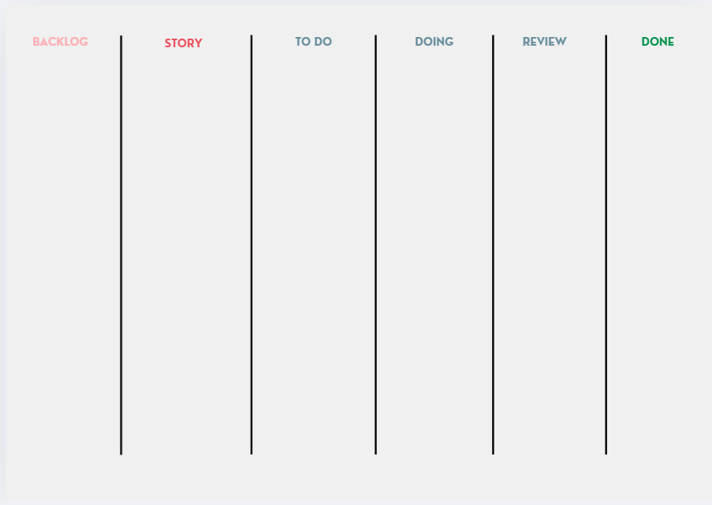

# Sprint 1

## Dates

2025-10-08 - 2025-10-19

## Scrum master

 Clara Sousa Dias 67215

## Management info
### Sprint Planning Meeting: 
goals:
- create 3 user stories
- review of the 3 user stories
meeting decisions: 
- decide beetween the 6 user stories we had already in mind
- creation of this weeks teams 
- work distribution

### Sprint Review Meeting: 
*(Held at the end of the sprint, this meeting is attended by all stakeholders to demo the completed work and validate if the sprint goal has been met.)*

### Sprint Retrospective Meeting: 
*(This meeting happens after the sprint review and before the next sprint planning meeting. The team reflects on what went well, what needs improvement, and how to enhance their processes for future sprints.)*

## Relevant resources

### Scrum Board at the beginning of the sprint

### Scrum Board in the middle of the sprint

Please add the scrumboard picture here.

### Scrum Board at the end of the sprint

Please add the scrumboard picture here.

### Burndown Chart for the sprint

Please add the burndown chart here.

### Gantt Chart

Please add the Gantt chart here.
