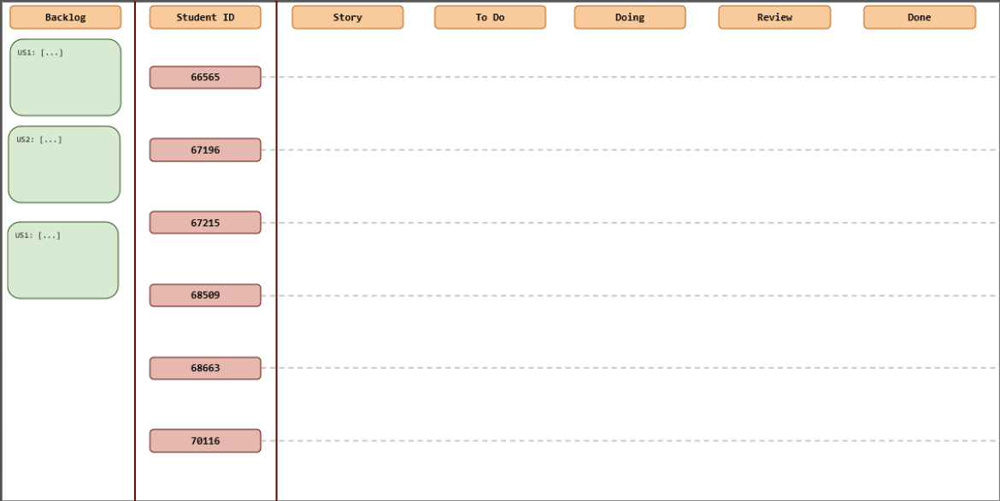
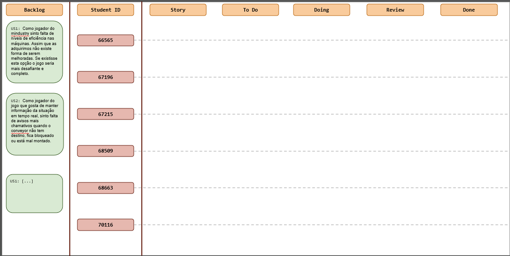
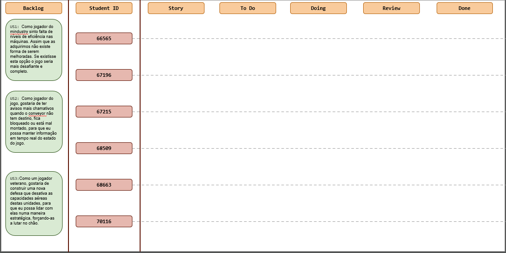
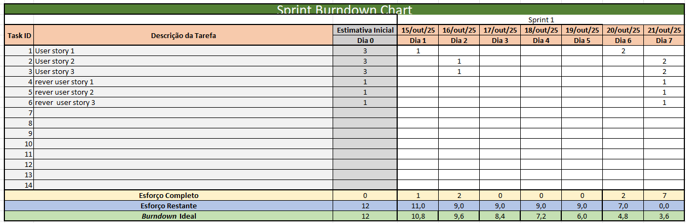
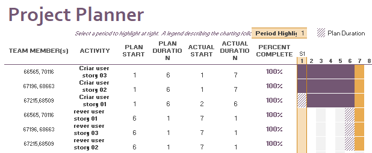

# Sprint 1

## Dates

2025-10-14 - 2025-10-22

## Scrum master

 Clara Sousa Dias 67215

## Management info
### Sprint Planning Meeting: 
goals:
- create 3 user stories
- review of the 3 user stories
meeting decisions: 
- decide beetween the 6 user stories we had already in mind
- creation of this weeks teams 
- work distribution

### Sprint Review Meeting: 

The group was able to acomplish every assigned goal for the sprint.

### Sprint Retrospective Meeting: 
Time management can be improved.
Every goal was achieved within the expected time window, the good team communication was a big part of being able to do so.

## Relevant resources

### Scrum Board at the beginning of the sprint

### Scrum Board in the middle of the sprint

### Scrum Board at the end of the sprint

### Burndown Chart for the sprint

### Gantt Chart

