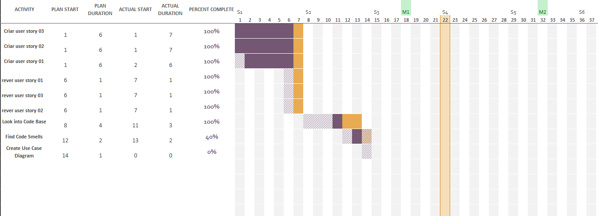

# Sprint 2

## Dates

2025-10-22 - 2025-10-29

## Scrum master

Rafael Soares 70116

## Management info
### Sprint Planning Meeting: 
 >#### Sprint Goals :
> * Look into the game's codebase
> * Find Code Smells present in the code
> * Creation of use case diagrams 
  
> #### Meeting decisions:
> * Workload distribution for the week

### Sprint Review Meeting: 
> Since the team was only able to look into the codeBase during this sprint, there was nothing tangible to verify or validate
### Sprint Retrospective Meeting: 
> Due to a tight academic schedule our team wasn't able to successfully finish this sprint, nevertheless we noticed a significant improvement on our communication as a team compared to the last sprint, however, it is of utmost importance that we improve our time management capabilities.

## Relevant resources

### Scrum Board at the beginning of the sprint

### Scrum Board in the middle of the sprint

### Scrum Board at the end of the sprint

### Burndown Chart for the sprint

### Gantt Chart

