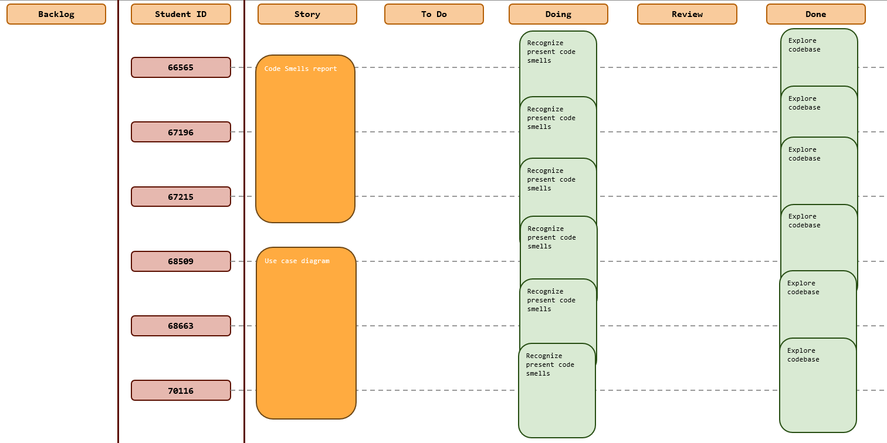
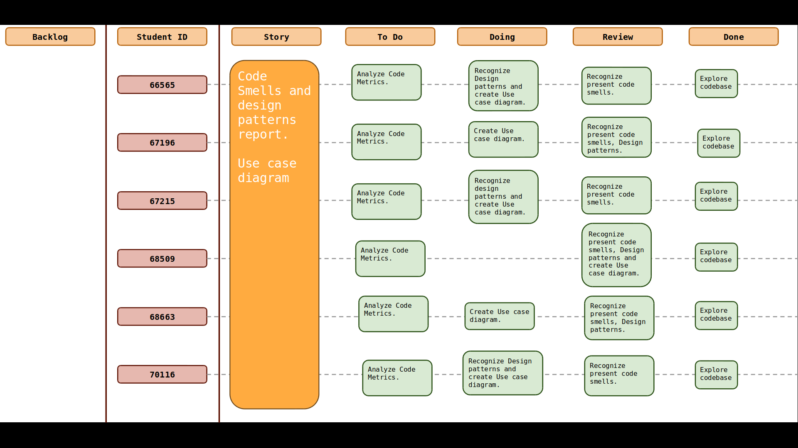
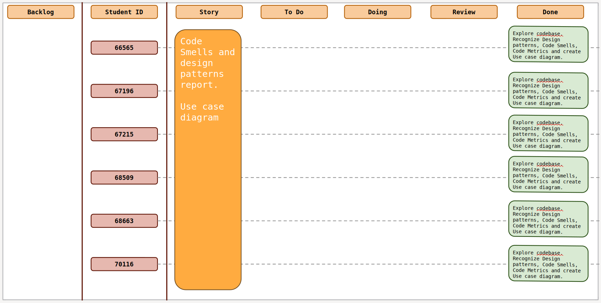
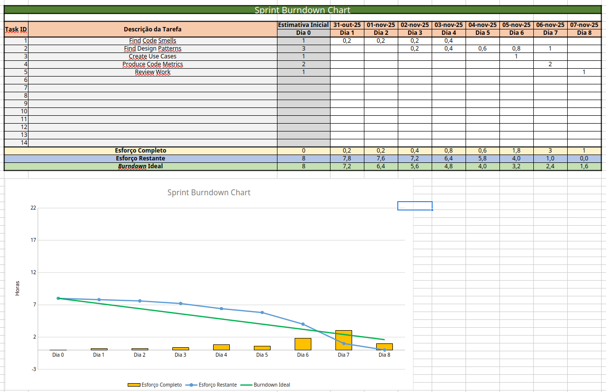
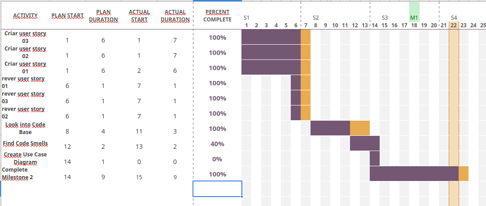

# Sprint 3

## Dates

2025-10-27 - 2025-11-02

## Scrum master

Ricardo Batista 68509

## Management info

### Sprint Planning Meeting: 

#### Sprint Goals :

- Identification of Code Smells
- Identification of Design Patterns
- Creation of Use Case Diagrams 
  
#### Meeting decisions:
- Tasks were distributed according to the Milestone 2 objective:
    - Each member has to identify 3 code smells, 3 design patterns and create 1 use case diagram.

### Sprint Review Meeting: 

### Sprint Retrospective Meeting: 

## Relevant resources

### Scrum Board at the beginning of the sprint

### Scrum Board in the middle of the sprint

### Scrum Board at the end of the sprint

### Burndown Chart for the sprint

### Gantt Chart

