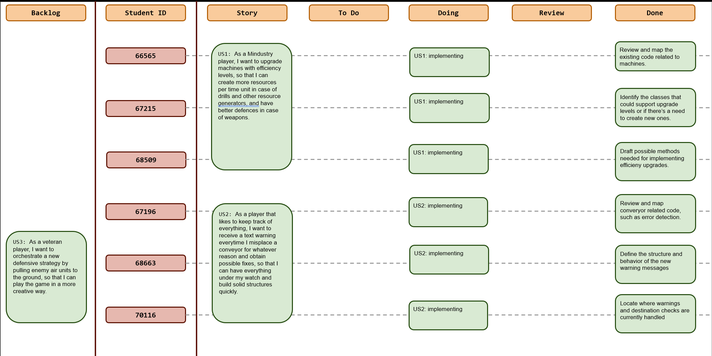
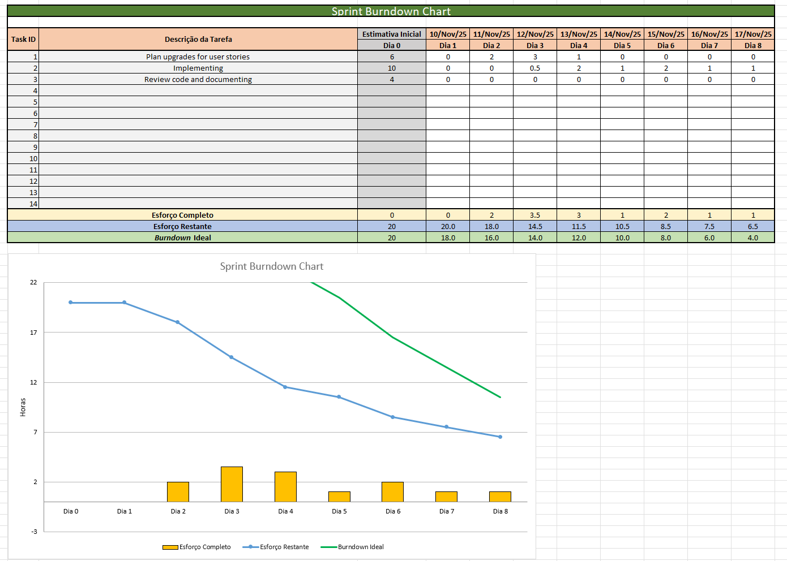
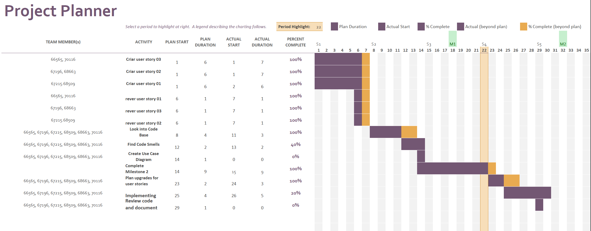

# Sprint 4

## Dates

2025-11-10 - 2025-11-17

## Scrum master

Afonso Rodriguez 66565

## Management info
### Sprint Planning Meeting: 
In this meeting we decided to split into 2 teams of 3 members, in order to focus on the first 2 US. Each team was given the task of deep diving their US's code base, looking for potential classes and methods needed for the implementation.
>#### Sprint Goals :
> * Deliver initial implementation of the first two User Stories.
> * Establish a shared understanding between both teams to reduce rework in later sprints.

### Sprint Review Meeting: 
This sprint's goals were not all achieved.
### Sprint Retrospective Meeting: 
Due to a tight academic schedule our team wasn't able to produce as much work as expected in the planning meeting, something that definitely needs work for sprints to come.
## Relevant resources

### Scrum Board at the beginning of the sprint

### Scrum Board in the middle of the sprint

### Scrum Board at the end of the sprint

### Burndown Chart for the sprint

### Gantt Chart

