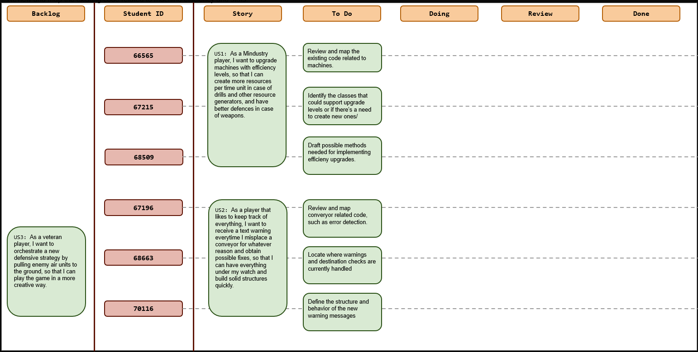
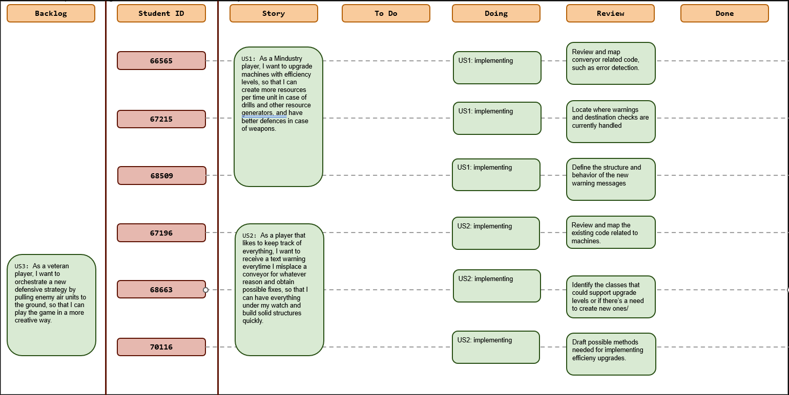

# Sprint 4

## Dates

2025-11-10 - 2025-11-17

## Scrum master

Afonso Rodriguez 66565

## Management info
### Sprint Planning Meeting: 
In this meeting we decided to split into 2 teams of 3 members, in order to focus on the first 2 US. Each team was given the task of deep diving their US's code base, looking for potential classes and methods needed for the implementation.
>#### Sprint Goals :
> * Deliver initial implementation of the first two User Stories.
> * Establish a shared understanding between both teams to reduce rework in later sprints.

### Sprint Review Meeting: 
*(Held at the end of the sprint, this meeting is attended by all stakeholders to demo the completed work and validate if the sprint goal has been met.)*

### Sprint Retrospective Meeting: 
*(This meeting happens after the sprint review and before the next sprint planning meeting. The team reflects on what went well, what needs improvement, and how to enhance their processes for future sprints.)*

## Relevant resources

### Scrum Board at the beginning of the sprint

### Scrum Board in the middle of the sprint

### Scrum Board at the end of the sprint

Please add the scrumboard picture here.

### Burndown Chart for the sprint

Please add the burndown chart here.

### Gantt Chart

Please add the Gantt chart here.
