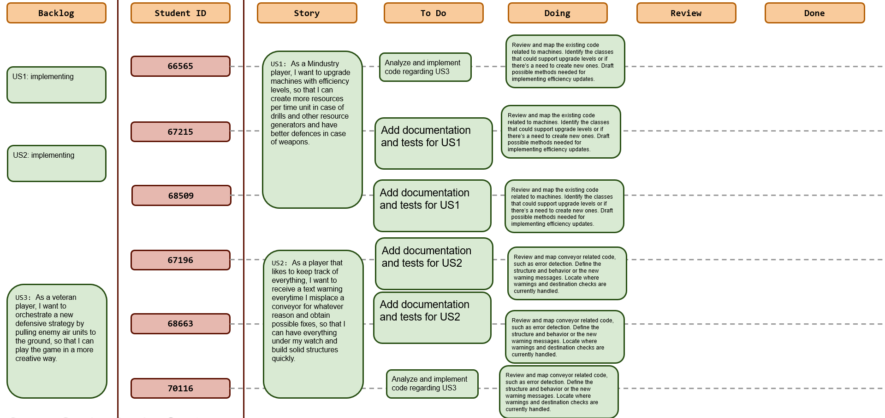
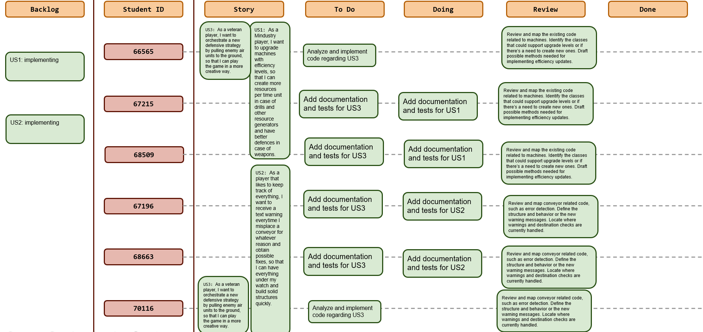
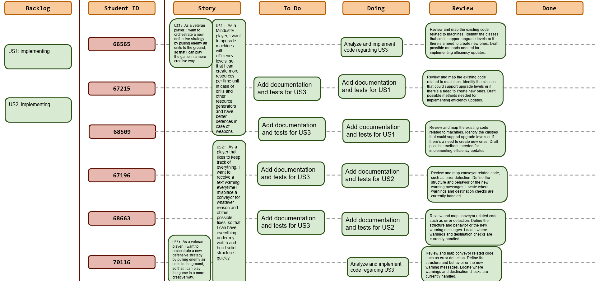
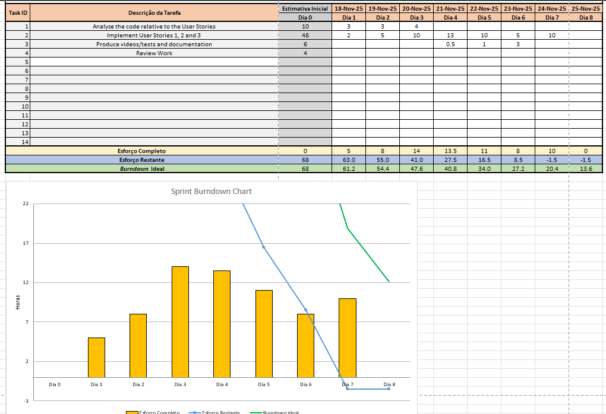
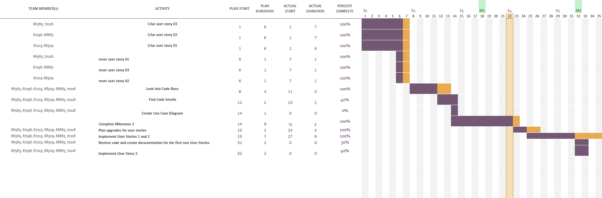

## Dates

2025-11-18 - 2025-11-25

## Scrum master

Guilherme Neto 68663

## Management info
### Sprint Planning Meeting: 
-Dicussed asking the teachers for feedback.
-Divided ourselves into smaller groups for each User Story.
-Assigned soft deadlines for the implementation to be done.

### Sprint Review Meeting: 
-The sprint's goal has been met.

### Sprint Retrospective Meeting: 
-We concluded that, in terms of hours put into this project and work done, this was one of our best sprints. We managed to communicate frequently and fluently.

## Relevant resources
-No relevant resources to add for this sprint.

### Scrum Board at the beginning of the sprint

### Scrum Board in the middle of the sprint

### Scrum Board at the end of the sprint

### Burndown Chart for the sprint

### Gantt Chart

