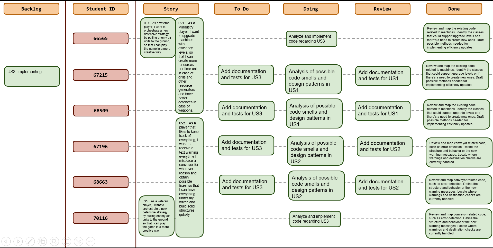
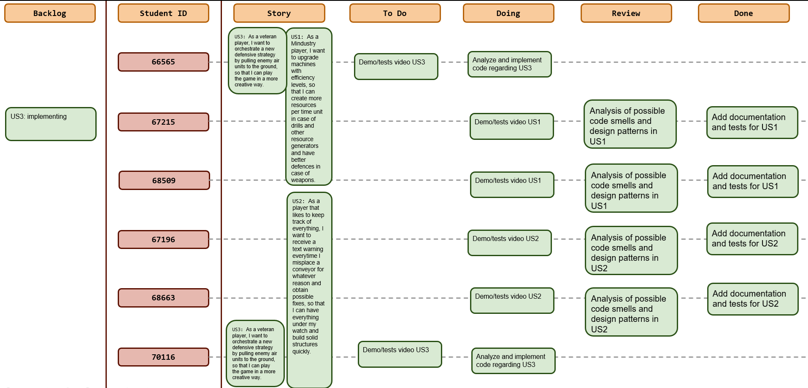
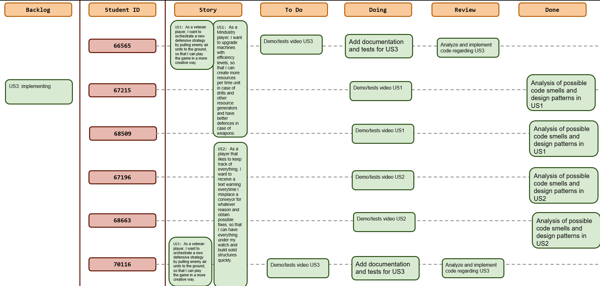
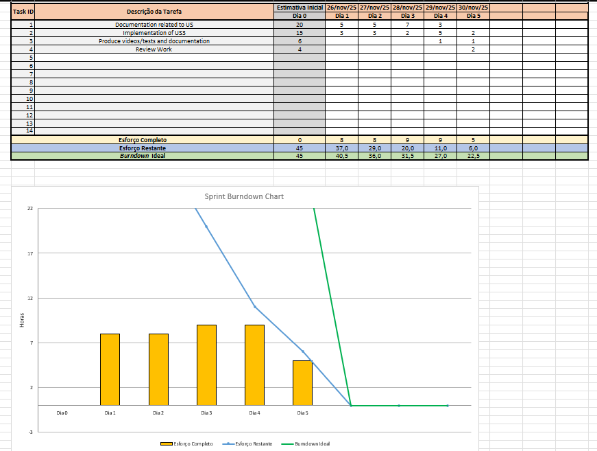
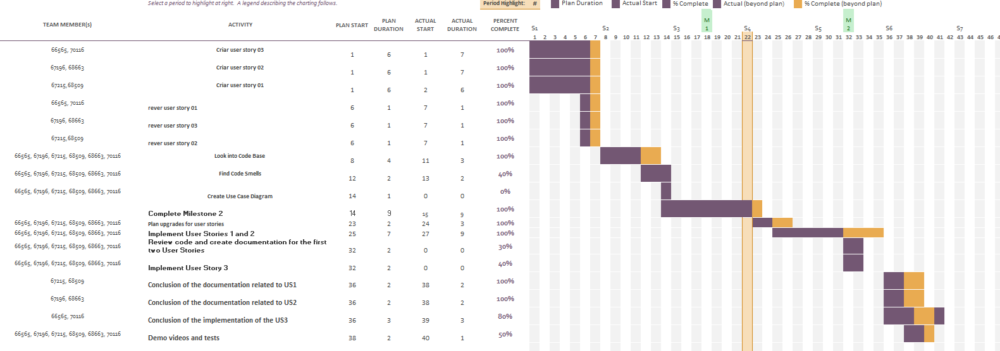

# Sprint 6

## Dates

2025-11-26 - 2025-11-30

## Scrum master

Raksana Udagedara 67196

## Management info
### Sprint Planning Meeting: 
Discussion of the project status;
Discussion of possible code improvements in US1 and US3.
Estabilish deadlines and plan the work until the final delivery.

### Sprint Review Meeting: 
Sprints goals have been achieved.

### Sprint Retrospective Meeting: 
The team members were organized and the communication of possible problems due to academic schedule during the sprint was essential.

## Relevant resources
None.

### Scrum Board at the beginning of the sprint

### Scrum Board in the middle of the sprint

### Scrum Board at the end of the sprint

### Burndown Chart for the sprint

### Gantt Chart

