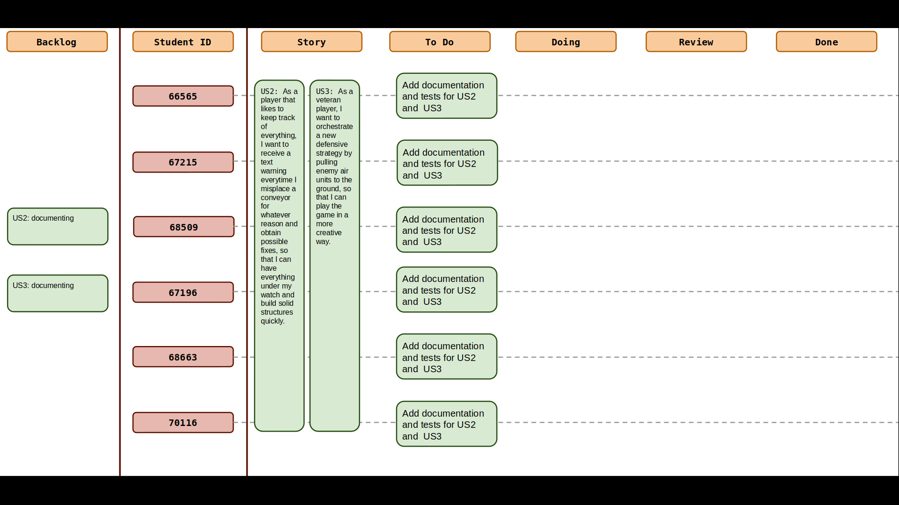
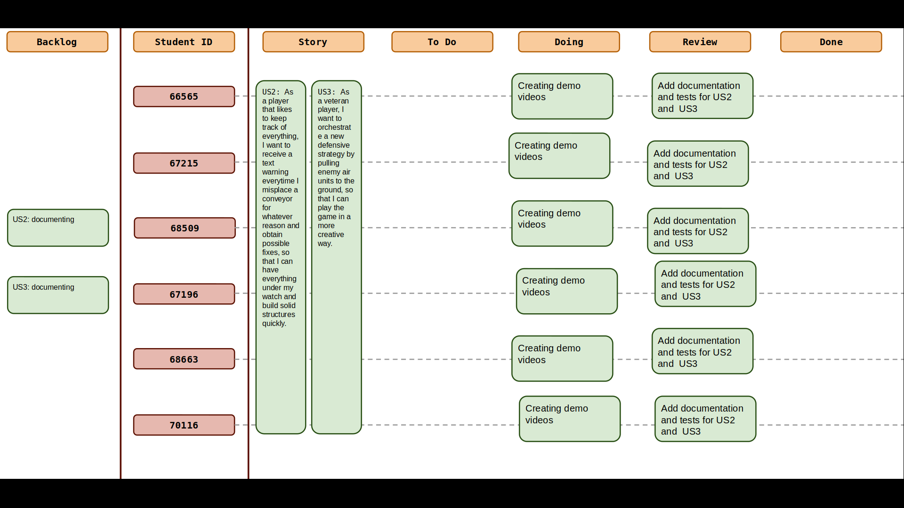
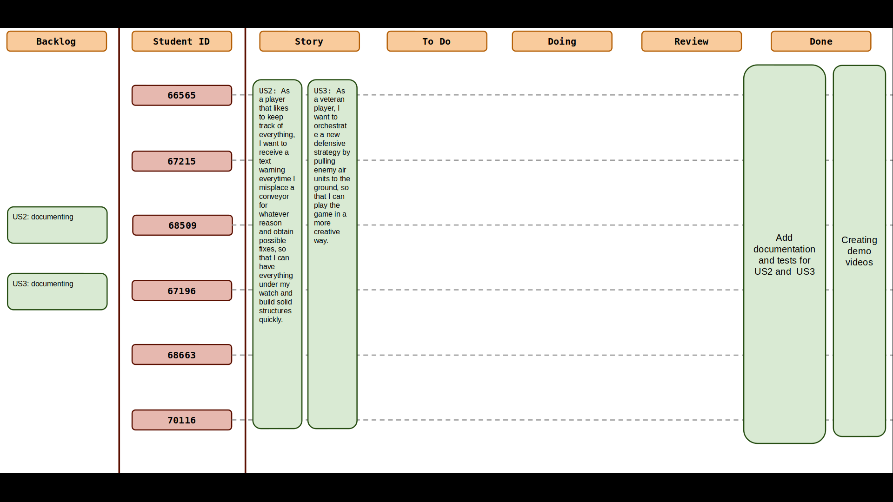
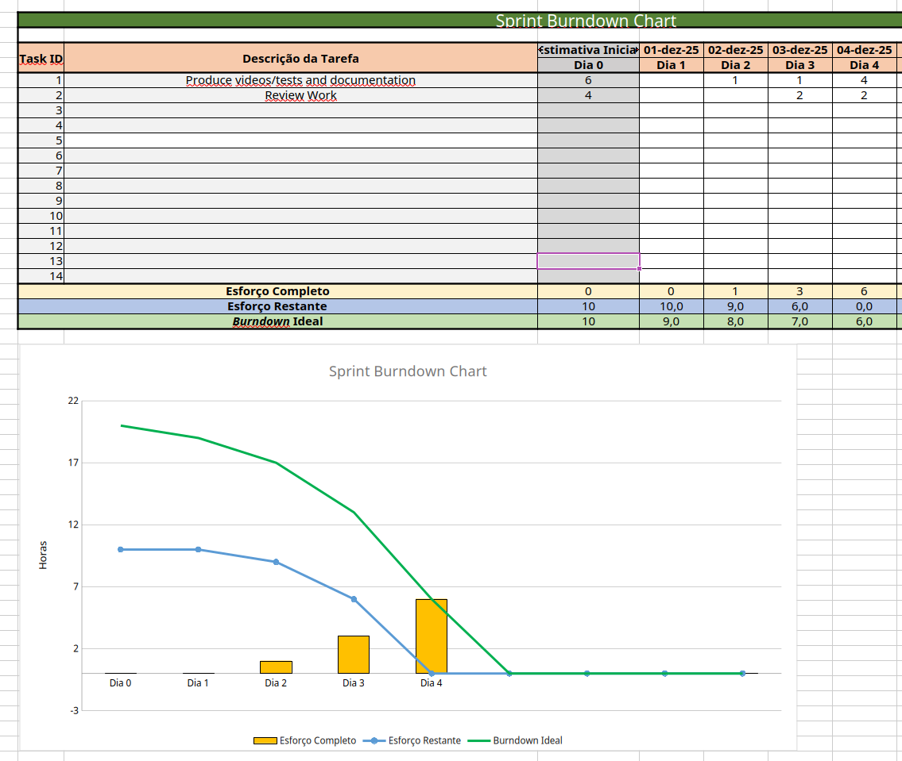
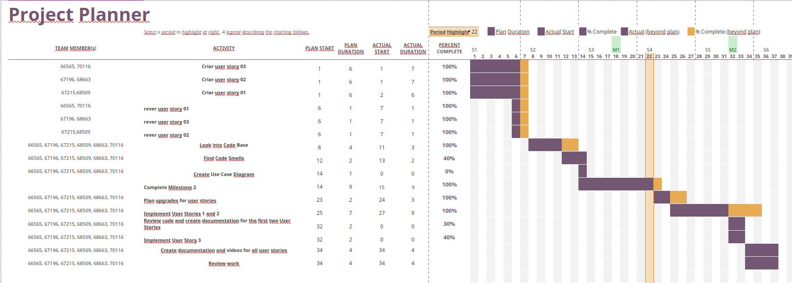

# Sprint 7

## Dates

2025-12-01 - 2025-12-04

## Scrum master

Ricardo Batista 68509

## Management info
### Sprint Planning Meeting: 
- Finish the documentation for US2 and US3
- Final touches to mark project as completed
- Final review

### Sprint Review Meeting: 
*(Held at the end of the sprint, this meeting is attended by all stakeholders to demo the completed work and validate if the sprint goal has been met.)*

### Sprint Retrospective Meeting: 
*(This meeting happens after the sprint review and before the next sprint planning meeting. The team reflects on what went well, what needs improvement, and how to enhance their processes for future sprints.)*

## Relevant resources

### Scrum Board at the beginning of the sprint

### Scrum Board in the middle of the sprint

### Scrum Board at the end of the sprint

### Burndown Chart for the sprint

### Gantt Chart

