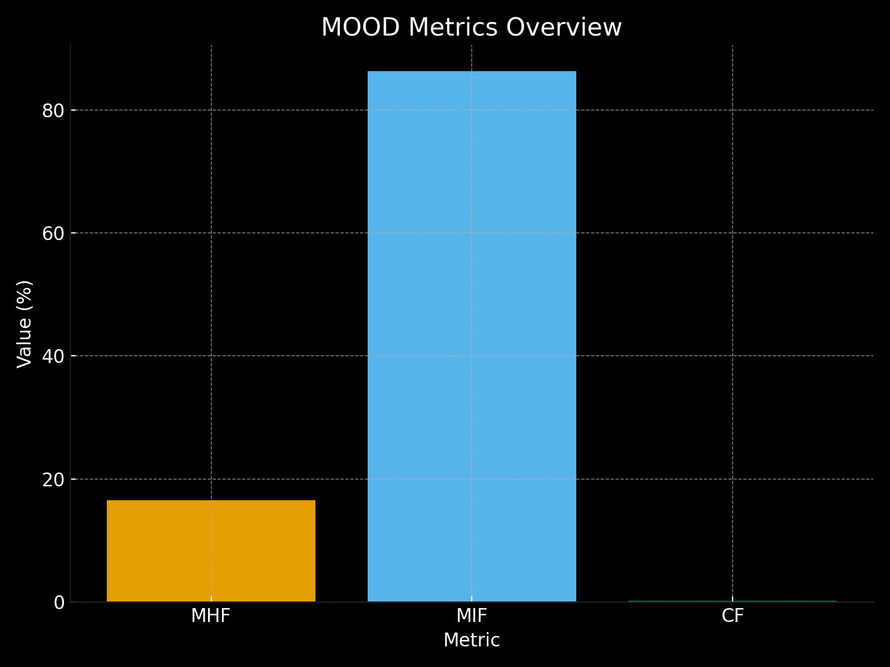

# Code Metrics Analysis: 

## This document focuses on my approach at evaluating the code metrics for some classes of Mindustry's source code. The chosen pattern was the MOOD (aka "Metrics for Object-Oriented Design") metrics set, more particularly Method Hiding Factor (MHF), Method Inheritance Factor (MIF) and Coupling Factor (CF).

Developed by many people, amongst which is none other than Miguel Goulão, Associate Professor of the Informatics Department of FCT/UNL, and the leading teacher for this project.

### After some digging, I discovered this metrics set is only for the project level, making it a bit harder to evaluate values, and taking conclusions upon them. Below is an image of the generated graph from my spreadsheet:

### 

### The source of this sample is the plugin "Metric Trees" for Intellij IDEA. There are some particularly noticeable values here, namely:
- The `MHF` metric had a value of 16.5610% (with a regular range of: `[9.5%..36.9%]`), a very low MHF value would indicate an insufficiently abstracted implementation, while a high MHF value would indicate very little functionality, we can take this to be a very good metric value as it is right within the regular interval.

- The `MIF` is defined as a quotient between the sum of inherited methods in all classes of the system. In this project we have a value of 86.2731%, which is above the maximum regular range of: `84.4%`. This could indicate several inheritance relations, that build a directed acyclic graph, whose depth and width make understandability and testability fade away quickly.

- Finally, the `CF` had a value of 0.1885% (with the maximum threshold being `24.3%`), since it is desirable that classes communicate with as few other classes as possible, and that they exchange as little information as possible, we can take this value as a very good one.
