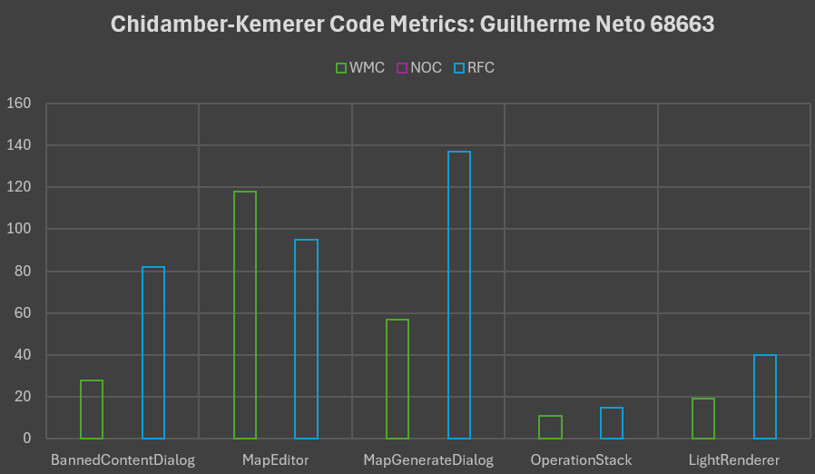

# Code Metrics Analysis: Guilherme Neto 68663

## This document focuses on my approach at evaluating the code metrics for some classes of Mindustry's source code. The chosen pattern was the Chidamber-Kemerer Set, more particularly Weighted Methods per Class (WMC), Number of Children (NOC), and Response for a Class (RFC).

### I chose to analyze five specific classes: BannedContentDialog, MapEditor, MapGenerateDialog, OperationStack and LightRenderer. Below is an image of the generated graph from my spreadsheet (also available in this directory and contains the file paths relative to the root of the repository):

### 

### The source of this sample is the plugin "Metric Trees" for Intellij IDEA. There are some particularly noticeable values here, namely:
- No class has any direct descendants, indicated by the fact that all of the `NOC` are equal to 0. These seem adequate, due to the fact that they already have very concrete concerns, therefore not needing any sort of specialization.

- `MapEditor` has a `WMC` of 118. Although this is a very busy class, since it has to draw a large number of assets (possibly several at a time) and do a considerable amount of verifications, this factor can somewhat easily be reduced, simply by avoiding some present code smells, namely Duplicated Code: for instance, `beginEdit()` has several implementations with different parameters, and `drawSquare()` and `drawCircle()` could be generalized and/or delegated to another class. However, due to the complexity of this function, a high `WMC` is expectable.

- `MapGenerateDialog` has a `RFC` of 137, which means that several methods can answer to a request of a specific instance. This seems normal to me, since the core idea of this class is to update and write/show assets, constantly editing textures, among other tasks; as such, the requests made to this class revolve more or less around the same base, which makes it reasonable that so many methods can answer the same problem.
However, this has an impact on its `WMC`, which has a value of 57, which appears mostly okay, except for Duplicated Code in the `show()` function.

- `OperationStack` has a `RFC` of 15. From my understanding of its source code, while low compared to the others, this seems like an ordinary value for a class that simply operates very similarly to a typical stack, due to its simple and linear structure.