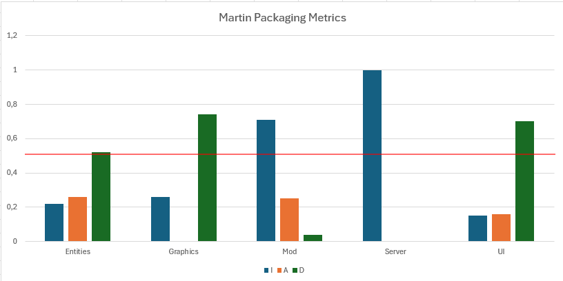

# Code Metrics Analysis:

## In this document, we will take a close look at the *Martin Packaging Metrics*, specifically the *Instability (I)*, *Abstractness (A)* and *Normalized Distance From Main Sequence(D)* submetrics.

### The five selected packages for analysis are as follows: entities, graphics, mod, server and ui.

### From this sample (using the MetricsTree plugin as source) some key takeaways are:
    - All of the sampled packages are within the preffered ranges of [0 , 0.3] and [0.7 , 1.0], as packages should avoid having intermediate stabilty.
        - The most unstable package of the five was server with a score of 1.0, whilst the one that presented the most stability was the ui package with 0.15. 

    - All packages with the exception of server are quite poor in relation to Abstractness when taking Instability into consideration, since optimally, these are inversely proportional
    - When it comes to Normalized Distance From Main Sequence, we have two major offenders, graph and ui, which surpass the regular threshold by 0.24 and 0.2, respectively. On the other hand, the server package presents an optimal value of 0.0, even though it is considered a very unstable package (as shown by its I value).

## Here is a graph showing the submetric values for each of the packages
