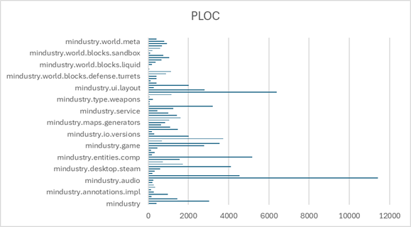
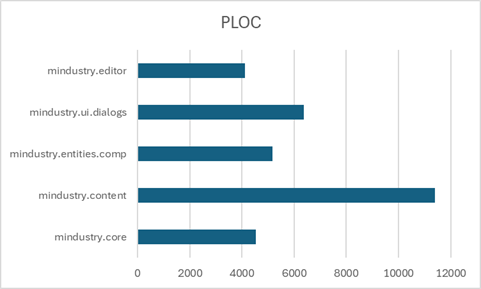
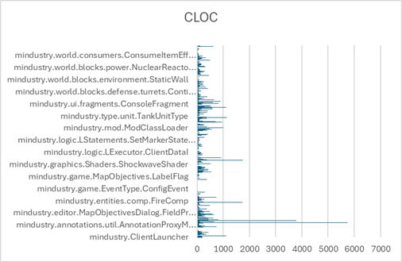
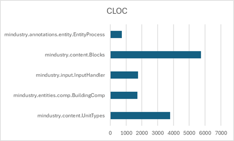
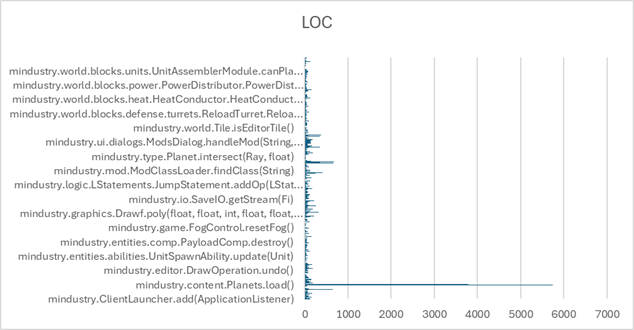
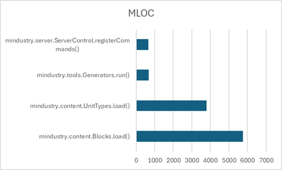

# Code Metrics : Lines of Code
## An analysis per package, class and method was done in order to find uncommon values for LOC. The LOC counts the lines of source code. It is a simple yet powerful metric to assess the complexity of software entities.
This metric has various related software quality properties such as: re-usability (both positively and negatively influenced by size); maintainability (declines with increasing LOC); portability (declines with increasing LOC); functionality (might increase with increasing LOC); reliability (might increase with increasing LOC); efficiency (might decline with increasing LOC);

### To illustrate the metric,  was chosen at each level the LOC value with the highest score:

Package level:
- `mindustry.core` - 4536
- `mindustry.content` - 11408
- `mindustry.entities.comp` - 5165
- `mindustry.ui.dialogs` - 6383
- `mindustry.editor` - 4105

Class level:
- `mindustry.content.UnitTypes` - 3783
- `mindustry.entities.comp.BuildingComp` - 1725
- `mindustry.input.InputHandler` - 1755
- `mindustry.content.Blocks` - 5752
- `mindustry.annotations.entity.EntityProcess` - 739

Method level:
- `mindustry.content.Blocks.load()` - 5752
- `mindustry.content.UnitTypes.load()` - 3783
- `mindustry.content.SerpuloTechTree.load()` - 643
- `mindustry.server.ServerControl.registerCommands()` - 662
- `mindustry.tools.Generators.run()` - 672

### The evaluation of these different levels explains the large size associated with the entire code of project 109572. Several quality properties are affected by this metric. To illustrate this we can consider:

- Analyzability: the time and effort necessary to diagnose causes of failures in a software entity or for identification of parts to be modified is directly related to its size.
- Changeability: requires prior understanding which is harder for large systems.
- Testability: the number of possible execution paths of a software increases with its size.

### Based on an analysis of the project, it is possible to verify that the application developer appears to have quite a few code smells, namely long methods and duplicated code, which directly influence this metric, thus increasing the lines of code. As it was said before, the large size influences the changeability because the time needed to understand the code is higher. This is strictly related to analyzability because since the changeability is harder, then analyzability increases too because the time consumed to identify possible failures increases.

Some classes only contain a single method, but that method is significantly long. Potential solutions to improve this metric include refactoring code smells and breaking these large methods into smaller ones. This would increase the number of methods while keeping the overall LOC relatively linear. Although this might slightly increase the LOC at the class or package level, it would likely improve the readability and maintainability of the code. This would improve the testability because the execution paths, even though they would be related, could be easier to identify possible problems.

### Overall, these peculiar values are more about programming style, apparently consistent throughout the project, rather than an excess of functionalities per method.
 
