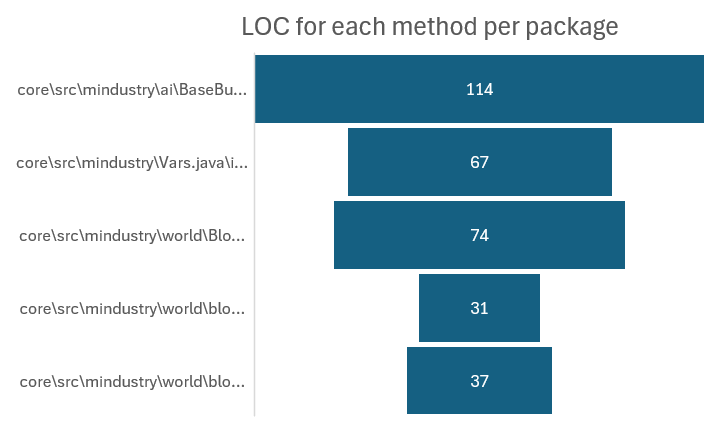
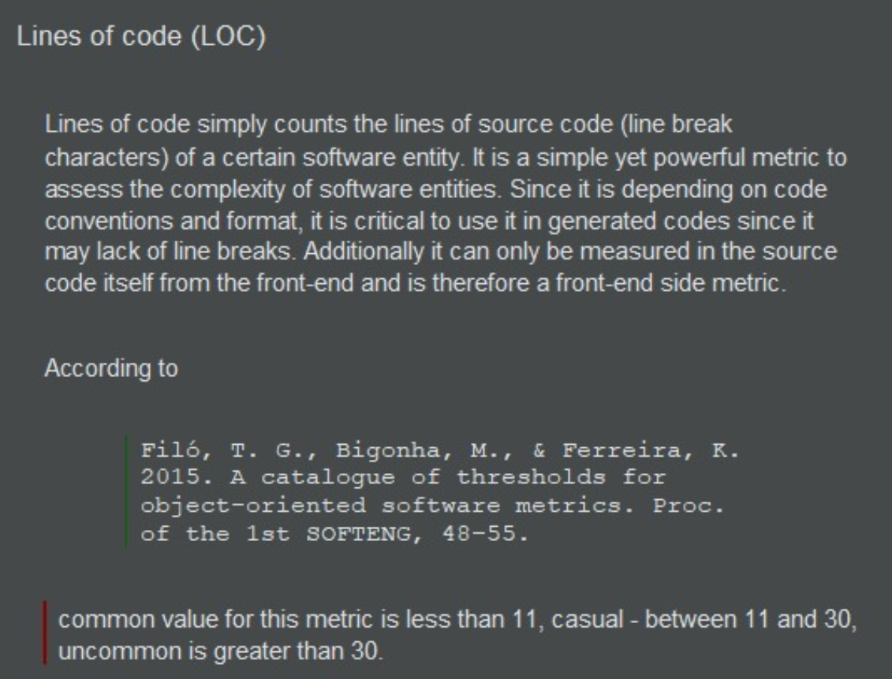

# Code Metrics : Lines of Code
## An analysis per method was done in order to find uncommon values for LOC within methods.
### The following methods and values were:
- `core\src\mindustry\ai\BaseBuilderAI.java`
- `update()` – this method has 114 LOC. 

- `core\src\mindustry\Vars.java`
- `init()` – this method has 67 LOC.
- `core\src\mindustry\world\Block.java`
- `createIcons()` – this method has 74 LOC.
- `core\src\mindustry\world\blocks\ConstructBlock.java`
- `constructFinish()` – this method has 37 LOC.
### The evaluation of these methods explains the large size associated with the entire code of project 109572. Several quality properties are affected by this metric, namely, reusability is positively and negatively influenced by size. Functionality may also decrease with increasing LOC.
### Based on an analysis of the project, it is possible to verify that the application developer appears to have quite a few code smells, namely long methods and duplicated code, which directly influence this metric, thus increasing the lines of code.

### Overall, these peculiar values are more about programming style, apparently consistent throught the project, rather than excess of functionalities per method.

### Below is a picture of my graphic, based on my research via the MetricsTree plugin.
### 

### This picture was taken directly from Intellij IDEA, defining the LOC value, which goes accordingly to my analysis.
### 