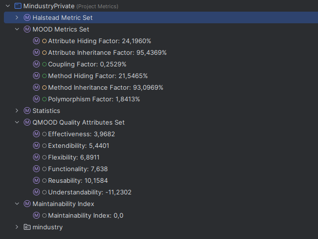

# Code Metrics Review — Dependencies

## Metrics

## Analysis Summary
- Overall, the numbers show low coupling but weak encapsulation and heavy inheritance.

## Key signals
- Coupling Factor: 0.2529% — very low static coupling (few references between classes/packages).
- Attribute Hiding Factor: 24.1960%, Method Hiding Factor: 21.5465% — most members are not hidden 
(many public/protected), so encapsulation is weak.
- Attribute Inheritance Factor: 95.4369%, Method Inheritance Factor: 93.0969% — heavy use of inheritance; many members 
come from superclasses.
- Polymorphism Factor: 1.8413% — little override/late-binding use.
- Reusability high but Understandability: -11.2302 and Maintainability Index: 0.0 — suggests reuse via inheritance but 
low readability/maintainability.

## What this means for dependencies
- Low coupling metric alone suggests few explicit links, but low hiding + many public members means components can still
be tightly dependent on internals (implicit coupling).
- Heavy inheritance creates tight compile‑time and design dependencies on base classes.
- Low polymorphism implies limited use of interface-based or abstract substitution; dependencies are likely concrete 
class links rather than abstractions.

## Practical checks and actions
- Inspect class/package-level coupling and cycle counts (afferent/efferent coupling, cyclic dependencies).
- Reduce public fields/methods: increase private/protected where possible to improve encapsulation.
- Prefer composition/interfaces over deep inheritance to decouple modules.
- Add unit tests around public API and refactor large base classes.

## Conclusion
- The project shows few explicit links but risky design (low hiding, deep inheritance).