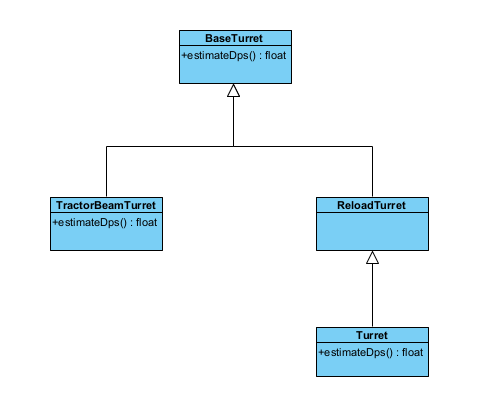
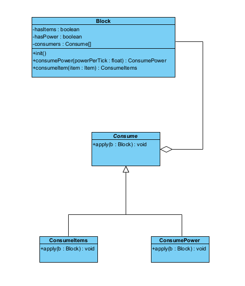
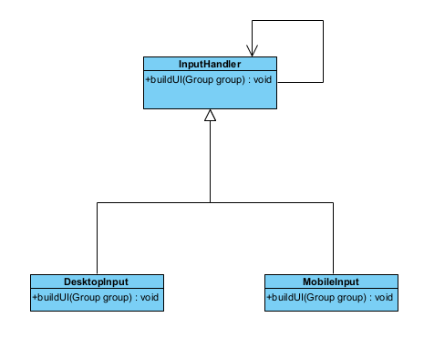

# **Design Patterns Analysis**

## *Template*
### Location: 
`core/src/mindustry/world/blocks/defense/turrets/BaseTurret.java`
`core/src/mindustry/world/blocks/defense/turrets/TractorBeamTurret.java`
`core/src/mindustry/world/blocks/defense/turrets/Turret.java`
(any specific block type)

### Analysis:
`BaseTurret` defines the overall shooting algorithm, while subclasses override specific steps. While not rewriting the whole algorithm, only doing so to the parts they need.

### Code snippet:
```java
public class BaseTurret extends Block {
    
    public float estimateDps(){
        return 0f; //subclasses override with real computation
    }
}

public class TractorBeamTurret extends BaseTurret {

    @Override
    public float estimateDps(){
        if(!any || damage <= 0) return 0f;
        return damage * 60f * efficiency * coolantMultiplier;
    }
}

public class Turret extends ReloadTurret { //ReloadTurret extends BaseTurret, delegating its way of estimating the dps to its subclass.

    public float estimateDps(){
        if(!hasAmmo()) return 0f;
        return shoot.shots / reload * 60f * (peekAmmo() == null ? 0f : peekAmmo().estimateDPS()) * potentialEfficiency * timeScale;
    }
}
```

### UML diagram:


## *Decorator*
### Location:
`core/src/mindustry/world/Block.java`
`core/src/mindustry/world/consumers/ConsumePower.java`
`core/src/mindustry/world/consumers/ConsumeItems.java`

### Analysis:
This pattern is used to add optional, dynamic behaviors to blocks via consumers. Blocks don't inherit power usage behavior from a superclass. The class `ConsumePower` is a concrete decorator that gives new abilities to a block.

### Code snippet:
```java
public class Block extends UnlockableContent implements Senseable {

    /** If true, buildings have an ItemModule. */
    public boolean hasItems;
    
    /** If true, buildings have a PowerModule. */
    public boolean hasPower;
    
    /** Array of consumers used by this block. Only populated after init(). */
    public Consume[] consumers = {};
    
    /** List for building up consumption before init(). */
    protected Seq<Consume> consumeBuilder = new Seq<>();
}

public class ConsumePower extends Consume {

    @Override
    public void apply(Block block){
        block.hasPower = true; //Decorator adds new capability.
        block.consPower = this;
    }
}

public class ConsumeItems extends Consume {

    @Override
    public void apply(Block block){
        block.hasItems = true; //Decorator adds new capability.
        block.acceptsItems = true;
        for(var stack : items){
            block.itemFilter[stack.item.id] = true;
        }
    }
}
```
### UML diagram:


## *Chain of Responsibility*
### Location:
`core/src/mindustry/input/InputHandler.java`
`core/src/mindustry/input/DesktopInput.java`
`core/src/mindustry/input/MobileInput.java`

### Analysis:
Each handler implements some subset of input behaviors, if one handler cannot process the event (i.e. not in the correct input mode), it simply forwards the event to the next handler in the chain.

### Code snippet:
```java
public abstract class InputHandler implements InputProcessor, GestureListener {
    
    public void buildUI(Group group){

    }
}

public class DesktopInput extends InputHandler {

    public void buildUI(Group group){
        //building and respawn hints
        group.fill(t -> {
            t.color.a = 0f;
            t.visible(() -> (t.color.a = Mathf.lerpDelta(t.color.a, Mathf.num(showHint()), 0.15f)) > 0.001f);
            t.bottom();
            
            //.
            //.
            //.
    }
}

public class MobileInput extends DesktopInput {

    @Override
    public void buildUI(Group group){

        group.fill(t -> {
            t.visible(this::showCancel);
            t.bottom().left();
            t.button("@cancel", Icon.cancel, Styles.clearTogglet, () -> {
                if(!player.dead()){
                    player.unit().clearBuilding();
                }
                selectPlans.clear();
                mode = none;
                block = null;
            }).width(155f).checked(b -> false).height(50f).margin(12f);
        });
        
        //.
        //.
        //.
    }
}
```

### UML diagram:
