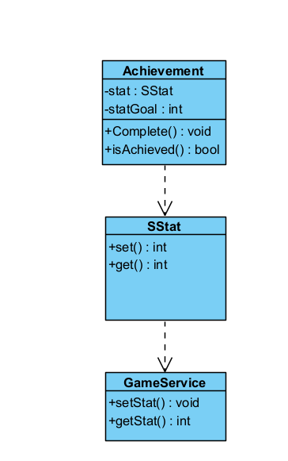
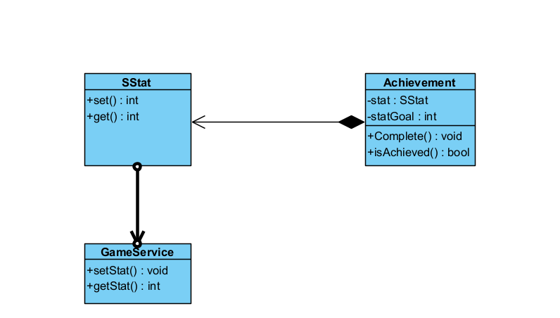

# **Design Patterns Analysis**

## *Command*
### Location: `core/src/mindustry/service/achievement`


### Analysis: 
Achievement is an enum that allows to encapsulate an operation as an object, allowing it to be triggered in a decoupled manner.




## *Obeserver*
### Location: `core/src/mindustry/service/achievement`


### Analysis: 
 The Achievement enum is checking if the achievement was completed in SStat if so, sends the information to the GameService.

```java

public void complete(){
        if(!isAchieved()){
            //can't complete achievements with the dev console shown.
            if(ui != null && ui.consolefrag != null && ui.consolefrag.shown() && !OS.username.equals("anuke") && this != openConsole) return;

            service.completeAchievement(name());
            service.storeStats();
        }
    }

```


## *Facade*
### Location: `core/src/mindustry/net/BecControl`


### Analysis: 
 BeControl is a Facade that encapsulates and coordinates a series of complex operations related to the Bleeding Edge system.
It provides a simplified interface — such as checkUpdate(), showUpdateDialog(), and download() — that hides a complex network of internal dependencies.

```java

public void showUpdateDialog(){
....
            ui.showCustomConfirm(Core.bundle.format("be.update", "") + " " + updateBuild, "@be.update.confirm", "@ok", "@be.ignore", () -> {}
            ...
}
````
