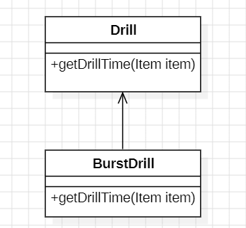
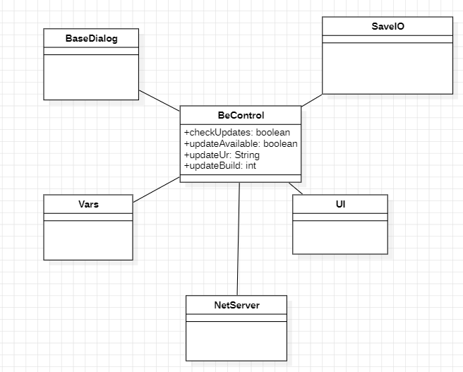

# **Design Patterns Analysis**

## *Command*
### Location: `core/src/mindustry/service/achievement`


### Analysis: 
Achievement is an enum that allows to encapsulate an operation as an object, allowing it to be triggered in a decoupled manner.


## *Template Method*
### Location: `core/src/mindustry/World/production/ Drill`


### Analysis: 
 The drill represents a classic Template Method design pattern, given that there is another class that extends some of it's methods

```java

public class Drill extends Block {
    public float getDrillTime(Item item) {
        return (drillTime + hardnessDrillMultiplier * item.hardness) / drillMultipliers.get(item, 1f);
    }
}

    public class BurstDrill extends Drill {
        public float getDrillTime(Item item) {
            return drillTime / drillMultipliers.get(item, 1f);
        }
    }    
```


## *Facade*
### Location: `core/src/mindustry/net/BecControl`


### Analysis: 
BeControl is a Facade that encapsulates and coordinates a series of complex operations related to the Bleeding Edge system.
As we can see through the code snippet, the class has a simple interface (global variables are booleans, string and int), yet contains a complex network of classes inside its methods, clearly revealing a Facade design pattern.
For better understanding, I suggest checking the class diagram.

## Code Snippet
```java
public class BeControl{
    private static final int updateInterval = 60;

    private boolean checkUpdates = true;
    private boolean updateAvailable;
    private String updateUrl;
    private int updateBuild;
    public BeControl(){
        if(active()){
            Timer.schedule(() -> {
                if((Vars.clientLoaded || headless) && checkUpdates && !mobile){
                    checkUpdate(t -> {});
                }
            }, updateInterval, updateInterval);
        }
        public void showUpdateDialog(){
            if(!updateAvailable) return;

            if(!headless){
                checkUpdates = false;
                ui.showCustomConfirm(Core.bundle.format("be.update", "") + " " + updateBuild, "@be.update.confirm", "@ok", "@be.ignore", () -> {
                    try {
                        boolean[] cancel = {false};
                        float[] progress = {0};
                        int[] length = {0};
                        Fi file = bebuildDirectory.child("client-be-" + updateBuild + ".jar");
                        Fi fileDest = OS.hasProp("becopy") ?
                                Fi.get(OS.prop("becopy")) :
                                Fi.get(BeControl.class.getProtectionDomain().getCodeSource().getLocation().toURI().getPath());

                        BaseDialog dialog = new BaseDialog("@be.updating");
                        ...
                    }
            ...
                
            }
}
````
