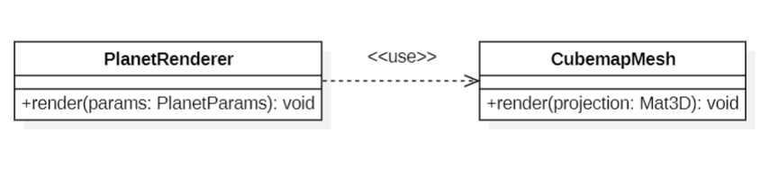
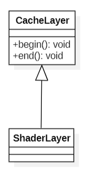
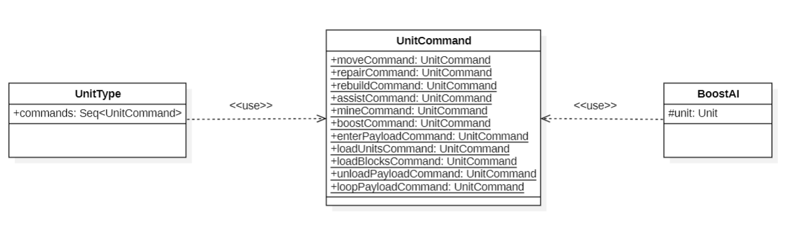

# **Design Patterns Analysis**

## *Facade*

### Location: `core/src/mindustry/graphics/CubemapMesh.java`

### Description: 
The class `CubemapMesh` has a `render()` method, which hides all the complexity within an OpenGL based system, thus making interaction with it easier for whatever ends up using this code.

### Analysis/Justification:
The `render()` method abstracts most of the overly deep and complicated calls related to OpenGL, such as direct shader and attribute manipulation; the user, as well as classes that take advantage of this operation, such as `PlanetRenderer`, do not need to know how it works in the OpenGl code.

### Illustrating Code Snippet:
```java
public class CubemapMesh implements Disposable{
    //Variables and other methods of the class

    public void render(Mat3D projection){
            map.bind();
            shader.bind();
            shader.setUniformi("u_cubemap", 0);
            shader.setUniformMatrix4("u_proj", projection.val);
            mesh.render(shader, Gl.triangles);
        }

    //Rest of the CubemapMesh class
}
public class PlanetRenderer implements Disposable{
    //Variables and other methods of the class
    public void render(PlanetParams params){
        //Rest of the render method
        skybox.render(cam.combined);
        skybox.render(cam.combined);
        //Rest of the render method
    }
    //Rest of the PlanetRenderedClass
}
```
### UML Diagram:
### 

## *Template Method*

### Location: `core/src/mindustry/graphics/CacheLayer.java`

### Description: 
The superclass `CacheLayer` assigns specific implementation responsibilities to its subclass, `ShaderLayer`.

### Analysis/Justification:
`CacheLayer` contains several methods, two of which, `begin()` and `end()`, match a Template Method design pattern: both of these are simply not implemented in the superclass, and are instead overriden by a static class defined inside it called `ShaderLayer`, which does provide the concrete implementation.

### Illustrating Code Snippet:
```java
public class CacheLayer{
    //Rest of the class


    /** Called before the cache layer begins rendering. Begin FBOs here. */
    public void begin(){

    }

    /** Called after the cache layer ends rendering. Blit FBOs here. */
    public void end(){

    }

    public static class ShaderLayer extends CacheLayer{
        //Rest of the class

        @Override
        public void begin(){
            if(!renderer.animateWater) return;

            renderer.effectBuffer.begin();
            Core.graphics.clear(Color.clear);
            renderer.blocks.floor.beginDraw();
        }

        @Override
        public void end(){
            if(!renderer.animateWater) return;

            renderer.effectBuffer.end();
            renderer.effectBuffer.blit(shader);
            renderer.blocks.floor.beginDraw();
        }
    }
}
```
### UML Diagram:
### 


## *Command*

### Location: `core/src/mindustry/ai/UnitCommand.java`

### Description: 
The class `UnitCommand` has several variables that represent different commands, which the class `UnitType` adds to its command list.

### Analysis/Justification:
The mentioned variables offered by `UnitCommand`, which in itself represents a command, have a reasonable amount of usages, some of which include each `UnitType` adding them to a list of commands, and a concrete unit using one of them in the `BoostAI`class. The `UnitCommand` class itself also keeps track of the commands and manipulates them. 

### Illustrating Code Snippet:
```java
public class UnitCommand extends MappableContent{
    public static UnitCommand moveCommand, repairCommand, rebuildCommand, assistCommand, mineCommand, boostCommand, enterPayloadCommand, loadUnitsCommand, loadBlocksCommand, unloadPayloadCommand, loopPayloadCommand;
    //Rest of the UnitCommand class

    /*
    Manipulating the commands.
    The remaining commands are managed in a very similar way,
    hidden to keep the snippet smaller.
    */
    repairCommand = new UnitCommand("repair", "modeSurvival", Binding.unitCommandRepair, u -> new RepairAI());
        rebuildCommand = new UnitCommand("rebuild", "hammer", Binding.unitCommandRebuild, u -> new BuilderAI());
        assistCommand = new UnitCommand("assist", "players", Binding.unitCommandAssist, u -> {
            var ai = new BuilderAI();
            ai.onlyAssist = true;
            return ai;
        });
        mineCommand = new UnitCommand("mine", "production", Binding.unitCommandMine, u -> new MinerAI()){{
            refreshOnSelect = true;
        
        
}
 }
}

public class BoostAI extends AIController{

    @Override
    public void updateUnit(){
        if(unit.controller() instanceof CommandAI ai){
            ai.defaultBehavior();
            unit.updateBoosting(true);

            //auto land when near target
            if(ai.attackTarget != null && unit.within(ai.attackTarget, unit.range())){
                //Executing command.
                unit.command().command(UnitCommand.moveCommand);
            }
        }
    }
}

public class UnitType extends UnlockableContent implements Senseable {
    //Initial declarations, hidden for readability
    if(commands.size == 0){
                //Adding the commands to the data structure.
                commands.add(UnitCommand.moveCommand, UnitCommand.enterPayloadCommand);

                if(canBoost){
                    commands.add(UnitCommand.boostCommand);

                    if(buildSpeed > 0f){
                    commands.add(UnitCommand.rebuildCommand, UnitCommand.assistCommand);
                    }
                    if(mineTier > 0){
                        commands.add(UnitCommand.mineCommand);
                    }
                }
    //Rest of the method

    }
    //Rest of the UnitType class
}

```
### UML Diagram:
### 