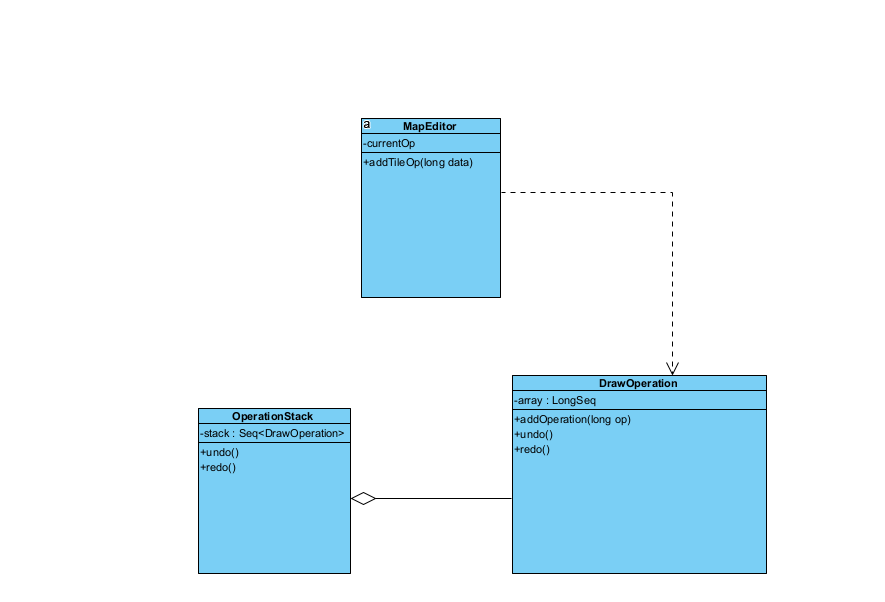

# **Design Patterns Analysis**

## **Design Pattern 1: Memento**

### Location: `core/src/mindustry/editor/DrawOperation.java`

### Analysis:
    - MapEditor class alters current state by using addTileOp (Originator)
    - DrawOperation class acts as a "snapshot" of the current state (Memento)
    - OperationStack class keeps track of and saves changes to state, and "pops" the top of stack when an "undo" is requested (Caretaker)

### Code Snippet:
```java
public class MapEditor {
    public void addTileOp(long data) {
        if (loading) return;

        if (currentOp == null) currentOp = new DrawOperation();
        currentOp.addOperation(data);

        renderer.updateStatic(TileOp.x(data), TileOp.y(data));
    }
}
 

public class DrawOperation {
     private LongSeq array = new LongSeq();

     public boolean isEmpty(){
         return array.isEmpty();
     }

     public int size(){
         return array.size;
     }

     public void remove(int amount){
         array.setSize(Math.max(0, array.size - amount));
     }

     public void addOperation(long op){
         array.add(op);
     }

     public void undo(){
         for(int i = array.size - 1; i >= 0; i--){
             updateTile(i);
         }
     }

     public void redo(){
         for(int i = 0; i < array.size; i++){
             updateTile(i);
         }
     }
 }
 
public class OperationStack{
    
    public void add(DrawOperation action){
        stack.truncate(stack.size + index);
        index = 0;
        stack.add(action);

        if(stack.size > maxSize){
            stack.remove(0);
        }
    }
    public void undo(){
        if(!canUndo()) return;

        stack.get(stack.size - 1 + index).undo();
        index--;
    }

    public void redo(){
        if(!canRedo()) return;

        index++;
        stack.get(stack.size - 1 + index).redo();

    }
}
```



## **Design Pattern 2: Command**

### Location: ``