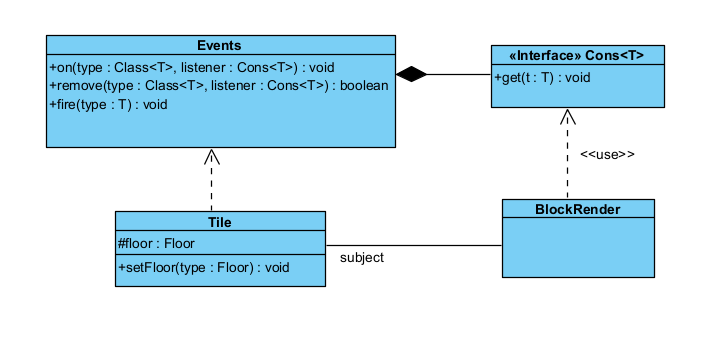
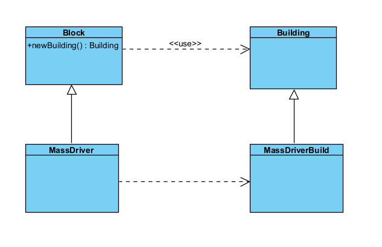

# **Design Patterns Analysis**

## *Observer*
### Location: `core\src\mindustry\world\Tile.java`
`core/src/mindustry/graphics/BlockRenderer.java`

### Analysis:
Class Tile uses Events.fire() - this notifies changes (TileFloorChangeEvenet e.g);
Events have a list (Cons<Tile>) that are the observers.
Each observer uses Events.on. When a fire() is called there is an update in the design pattern.

### Code snippet:
core\src\mindustry\world\Tile.java

```java
public void setFloor(Floor type){
if(this.floor == type) return;
    var prev = this.floor;
    this.floor = type;
    if(!world.isGenerating()){
        Events.fire(floorChange.set(this, prev, type)); // <-- notify
    }
}
````

core/src/mindustry/graphics/BlockRenderer.java

```java
public class BlockRenderer {
    public BlockRenderer(){ 
        Events.on(TilePreChangeEvent.class, this::on);
        Events.on(TileChangeEvent.class,     this::on);
}
````



## *Factory Method*
### Location: `core\src\mindustry\world\blocks\payloads\BlockProducer.java`
`core\src\mindustry\world\blocks\payloads\Constructor.java`
`core\src\mindustry\world\Block.java`
`core\src\mindustry\world\blocks\distribution\MassDriver.java`


### Analysis:
**Creator**: BlockProducer.BlockProducerBuild
**Concrete Creator**: Constructor.ConstructorBuild
**Product**: Block
**Concrete Product**: MassDriver


### Code snippet:
core\src\mindustry\world\blocks\payloads\BlockProducer.java

```java
public abstract class BlockProducer extends PayloadBlock{
    (...)
    public abstract @Nullable Block recipe();
        (...)
        public void draw(){
            Draw.rect(region, x, y);
                Draw.rect(outRegion, x, y, rotdeg()); 
                    var recipe = recipe();
(...)
        }
}
````

core\src\mindustry\world\blocks\payloads\Constructor.java

```java
public class Constructor extends BlockProducer {
    public class ConstructorBuild extends BlockProducerBuild{
        public @Nullable Block recipe;
        public @Nullable Block recipe(){ 
            return recipe;
        }
}
````

core\src\mindustry\world\Block.java

```java
public class Block extends UnlockableContent implements Senseable {
    public ItemStack[] requirements = {};
    public float buildTime = -1f;
    public int size = 1;
    public boolean rotate;
    public TextureRegion[] getGeneratedIcons(){ ... }
    ...
}
````

core\src\mindustry\world\blocks\distribution\MassDriver.java

```java
public class MassDriver extends Block { ... }
````



## *Template Method*
### Location: `core\src\mindustry\world\draw\DrawBlock.java`
`core\src\mindustry\world\blocks\defense\RegenProjector.java`
`core\src\mindustry\world\blocks\defense\turrets\Turret.java`

### Analysis:


### Code snippet:

```java
`core\src\mindustry\world\draw\DrawBlock.java`

public final TextureRegion[] finalIcons(Block block){
    if(iconOverride != null){
        var out = new TextureRegion[iconOverride.length];
        for(int i = 0; i < out.length; i++){
            out[i] = Core.atlas.find(block.name + iconOverride[i]);
        }
        return out;
    }
    TextureRegion[] icons = icons(block);
    return icons.length == 0 ? new TextureRegion[]{Core.atlas.find("error")} : icons;
}

`core\src\mindustry\world\blocks\defense\RegenProjector.java`

public TextureRegion[] icons(){
    return drawer.finalIcons(this);
}

`core\src\mindustry\world\blocks\defense\turrets\Turret.java`

public TextureRegion[] icons(){
    return drawer.finalIcons(this);
}
````


