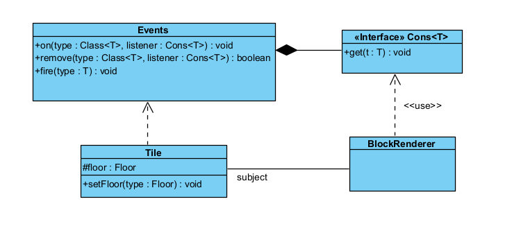
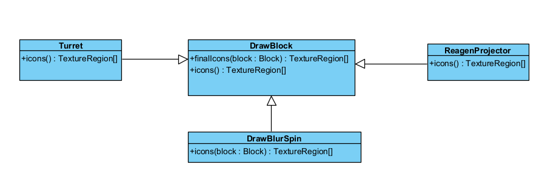

# **Design Patterns Analysis**

## *Observer*
### Location: `core\src\mindustry\world\Tile.java`
`core/src/mindustry/graphics/BlockRenderer.java`
`arc\Events.java`
`arc/func/Cons.java`

### Analysis:
Class Tile (concrete subject) uses Events.fire() - this notifies changes;
Each observer uses Events.on. So when a fire() is called there is an update in the design pattern.

### Code snippet:

`core\src\mindustry\world\Tile.java`

```java
    public void setFloor(Floor type){
        if(this.floor == type) return;

        var prev = this.floor;
        this.floor = type;

        if(!headless && !world.isGenerating() && !isEditorTile()){
            renderer.blocks.removeFloorIndex(this);
        }

        recache();
        if(build != null){
            build.onProximityUpdate();
        }
        if(!world.isGenerating() && pathfinder != null && !state.isEditor()){
            pathfinder.updateTile(this);
        }

        if(!world.isGenerating()){
            Events.fire(floorChange.set(this, prev, type));
        }

        if(this.floor != prev){
            this.floor.floorChanged(this);
        }
        //(...)
    }
````

`core/src/mindustry/graphics/BlockRenderer.java`

```java
public BlockRenderer(){
        Events.on(TilePreChangeEvent.class, event -> {
            if(blockTree == null || floorTree == null) return;

            if(indexBlock(event.tile)){
                blockTree.remove(event.tile);
                blockLightTree.remove(event.tile);
            }
            if(indexFloor(event.tile)) floorTree.remove(event.tile);
        });
        //(...)
}        

````
`arc\Events.java`
```java
//(I navigated to this class using Ctrl + click in Events.fire in the Tile class)

public class Events{
    private static final ObjectMap<Object, Seq<Cons<?>>> events = new ObjectMap<>();

    public static <T> void on(Class<T> type, Cons<T> listener){
        events.get(type, () -> new Seq<>(Cons.class)).add(listener);
    }
    public static <T> boolean remove(Class<T> type, Cons<T> listener){
        return events.get(type, () -> new Seq<>(Cons.class)).remove(listener);
    }

    public static <T> void fire(T type){
        fire(type.getClass(), type);
    }
    //(...)
}    
````
````java

`arc/func/Cons.java`
//(I navigated to this class using Ctrl + click in parameter Cons<T> listener in the Events class)

```java
package arc.func;

public interface Cons<T>{
    void get(T t);
}
````


## *Factory Method*
### Location: `core/src/mindustry/world/Block.java`
`core/src/mindustry/world/blocks/distribution/MassDriver.java`
`core/build/generated/source/kapt/main/mindustry/gen/Building.java` //(I navigated to this class using Ctrl + click in Building listener in the method newBuilding of Block class)


### Analysis:
**Creator**: Block (has the factory method)
**Concrete Creator**: MassDriver (extends the creator)
**Product**: Building (is used by creator)
**Concrete Product**: MassDriver.MassDriverBuild (extends the product)


### Code snippet:
`core/src/mindustry/world/Block.java`

```java

 public final Building newBuilding(){
        return buildType.get();
    }
````
```java

`core/src/mindustry/world/blocks/distribution/MassDriver.java`

public class MassDriver extends Block{
	(…)
}
````
```java
`core/src/mindustry/world/blocks/distribution/MassDriver.java`

//(inner class of MassDriver)

```java

public class MassDriverBuild extends Building implements RotBlock{ {
	(…)
}
````


## *Template Method*
### Location: `core\src\mindustry\world\draw\DrawBlock.java`
`core\src\mindustry\world\blocks\defense\RegenProjector.java`
`core\src\mindustry\world\blocks\defense\turrets\Turret.java`
`core\src\mindustry\world\draw\DrawBlurSpin.java`

### Analysis:
The method finalIcons is the template method, marked with final. The template method defines the steps to obtain the icons. The subclasses can have specific implementations of icons method.

### Code snippet:

`core\src\mindustry\world\draw\DrawBlock.java`
```java

public TextureRegion[] icons(Block block){
    return new TextureRegion[]{};
}

public final TextureRegion[] finalIcons(Block block){
    if(iconOverride != null){
        var out = new TextureRegion[iconOverride.length];
        for(int i = 0; i < out.length; i++){
            out[i] = Core.atlas.find(block.name + iconOverride[i]);
        }
        return out;
    }
    TextureRegion[] icons = icons(block);
    return icons.length == 0 ? new TextureRegion[]{Core.atlas.find("error")} : icons;
}
````

`core\src\mindustry\world\blocks\defense\RegenProjector.java`
```java
public TextureRegion[] icons(){
    return drawer.finalIcons(this);
}
````

`core\src\mindustry\world\blocks\defense\turrets\Turret.java`
```java
public TextureRegion[] icons(){
    return drawer.finalIcons(this);
}
````

`core\src\mindustry\world\draw\DrawBlurSpin.java`

```java
public TextureRegion[] icons(Block block){
    return new TextureRegion[]{region};
}

````



