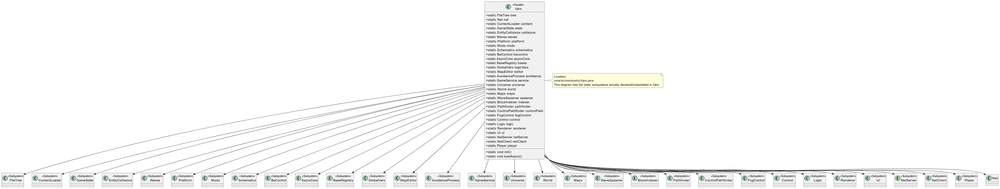

# Facade instance — Vars.java 
### Location: core/src/mindustry/Vars.java

## Class diagram (simplified)

Figure: Simplified class diagram showing Vars as the Facade coordinating subsystems

## Illustrating code snippet
```Java
public class Vars implements Loadable{
    // global subsystems / content holders (public statics used across the app)
    public static ContentLoader content;
    public static World world;
    public static Maps maps;
    public static UI ui;
    public static Net net;
    public static Mods mods;
    // ...many other static subsystems...

    // Facade-style orchestration: exposes simple init/loader methods that
    // hide the complexity of initializing many subsystems in the right order.
    public static void init(){
        // simplified illustration — actual file contains more steps and fields
        content = new ContentLoader();
        maps = new Maps();
        world = new World();
        ui = new UI();
        mods = new Mods();
        net = new Net();

        // orchestrate subsystem setup (assets, content, UI, networking)
        content.load();
        maps.load();
        mods.load();
        ui.setup();
        net.start();
    }
}
```

## Rationale of why Vars is a Facade:

#### Single, simple entry point: 
- Vars exposes a small set of high-level methods (init/loadAsync/…) that clients call instead of dealing with many subsystems directly.
#### Hides complexity: 
- The class coordinates asset loading, content registration, UI setup, networking and other initialization steps — clients need not know ordering or details.
#### Decouples callers from subsystems: 
- Code elsewhere references Vars.<subsystem> rather than instantiating or initializing subsystems itself.
#### Matches Facade intent: 
- Provide a unified interface over a set of interfaces (ContentLoader, Maps, World, UI, Net, Mods, Graphics, Audio).
