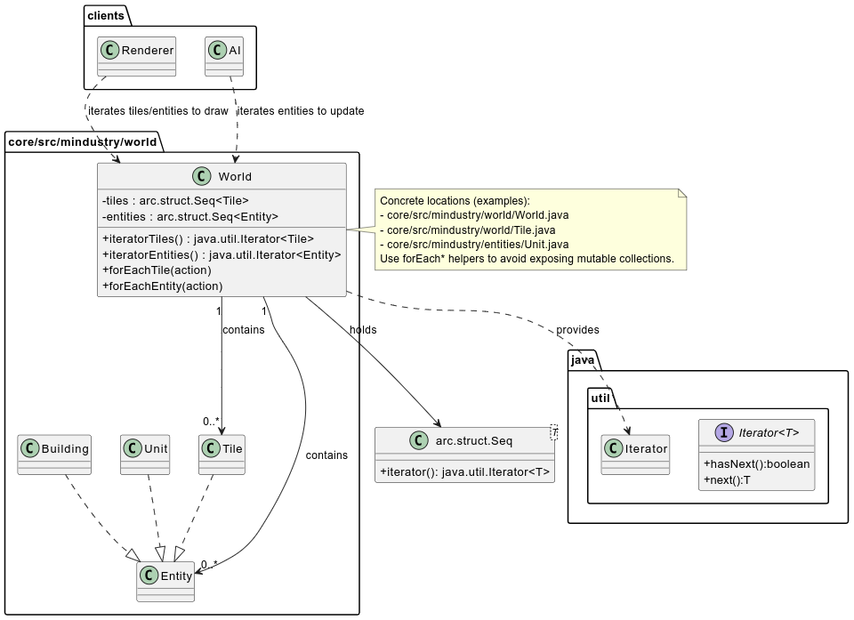

# Iterator 
### Location:
- `core/src/mindustry/world/World.java`, `core/src/mindustry/entities/Unit.java`, `core/src/mindustry/world/Tile.java` and usages that iterate collections (many places: AI, rendering, collision)

## Class diagram (simplified)


## Illustrating code snippet

```Java
// ...existing code...
public class World {
    public Seq<Tile> tiles = new Seq<>();
    public Seq<Entity> entities = new Seq<>();

    // classic Iterator provider (exposes underlying iterator)
    public Iterator<Tile> iteratorTiles(){
        return tiles.iterator();
    }

    // safer: iterator via callback to avoid exposing internal collection
    public void forEachTile(Consumer<Tile> action){
        for(int i = 0, n = tiles.size; i < n; i++){
            action.accept(tiles.get(i));
        }
    }

    // usage elsewhere (renderer)
    public void render(){
        // direct iterator usage
        Iterator<Tile> it = world.iteratorTiles();
        while(it.hasNext()){
            Tile t = it.next();
            t.draw();
        }

        // preferred: callback style (no external iterator object)
        world.forEachTile(t -> t.draw());
    }
}
// ...existing code...
```

## Rationale of why this corresponds to a Iterator Pattern:

- The World stores collections of tiles, entities, etc. and provides iterators/forEach helpers.
- Renderer and AI iterate those collections via iterator/forEach.