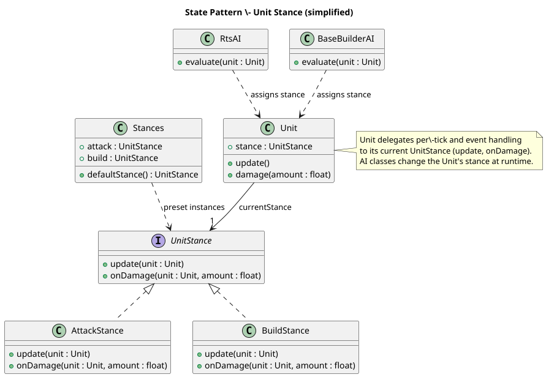

# StatePattern
### Location:
- `core/src/mindustry/ai/UnitStance.java`
- `core/src/mindustry/ai/RtsAI.java`
- `core/src/mindustry/entities/Unit.java`
- `core/src/mindustry/ai/BaseBuilderAI.java`

## Class diagram (simplified):


## Illustrating code snippet:

```Java
import java.beans.JavaBean;

// UnitStance.java
public interface UnitStance {
    void update(Unit unit);

    void onDamage(Unit unit, float amount);
}
```
```Java
// AttackStance.java
public class AttackStance implements UnitStance {
    @Override
    public void update(Unit unit) {
// aim/move/shoot behaviour encapsulated here
        unit.findTargetAndShoot();
    }

    @Override
    public void onDamage(Unit unit, float amount) {
// react while in attack stance
    }
}
```
```Java
// BuildStance.java

public class BuildStance implements UnitStance {
    @Override
    public void update(Unit unit) {
// building/repair behaviour
        unit.moveToBuildTarget();
    }

    @Override
    public void onDamage(Unit unit, float amount) {
// possibly abandon build or change stance
    }
}
```
```Java
// Unit.java (excerpt)
public class Unit {
public UnitStance stance = Stances.defaultStance(); // runtime-swappable state

    public void update(){
        // delegate per-tick behavior to current stance
        stance.update(this);
    }

    public void damage(float amount){
        // delegate reactions to stance
        stance.onDamage(this, amount);
    }
}
```
```Java 
// RtsAI.java (excerpt showing switching)
public class RtsAI {
    void evaluate(Unit unit){
        if(unit.shouldBuild()) unit.stance = Stances.build;
        else if(unit.hasEnemiesNearby()) unit.stance = Stances.attack;
        // switching behavior at runtime without conditionals scattered through Unit
    }
}
```

## Rationale of why this corresponds to a State Pattern:
- The behavior of Unit varies by its current UnitStance object rather than by large conditionals inside Unit.
- Concrete stance classes encapsulate distinct behavior (attack, build, idle), and the AI layers swap the stance 
reference at runtime. This isolates per-state behavior, makes it easy to add new stances, and reduces branching inside 
the Unit core logic.

## Evidence in repository:
- Unit delegates per-tick and event-handling responsibilities to a stance-like abstraction 
(see core/src/mindustry/entities/Unit.java).
- ai package contains UnitStance/UnitStance-named files and AI classes (RtsAI, BaseBuilderAI) that set or mutate the 
unit’s stance.
- Switching is done by assigning different stance objects rather than sprinkling if/else checks for mode across Unit 
methods.