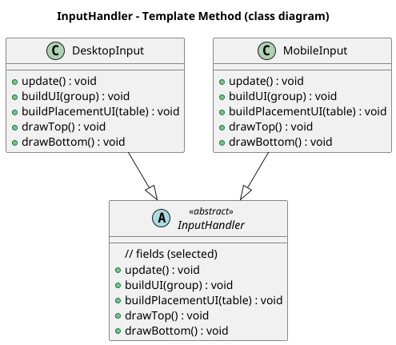

# Template Method — InputHandler.java
### Location: 
- `core/src/mindustry/input/InputHandler.java`
- `core/src/mindustry/input/DesktopInput.java`
- `core/src/mindustry/input/MobileInput.java`

## Class diagram (simplified)


## Illustrating code snippet

### InputHandler.java
```Java
public abstract class InputHandler implements InputProcessor, GestureListener {
    (...)
    public void update() {
        (...)
    }
    (...)
}
```

### DesktopInput.java
```Java
public class DesktopInput extends InputHandler{
    (...)
    public void update() {
        super.update();
        (...)
    }
    (...)
}
```

### MobileInput.java
```Java
public class MobileInput extends InputHandler implements GestureListener {
    (...)
    public void update() {
        super.update();
        (...)
    }
    (...)
}
```

## Rationale of why InputHandler is a Template Method:

- The abstract class InputHandler defines a general manner of input in the game. 
- Looking inside other classes like DesktopInput and MobileInput, they extend InputHandler and implement different ways 
of input but both classes follow the same steps defined in the abstract class InputHandler.

