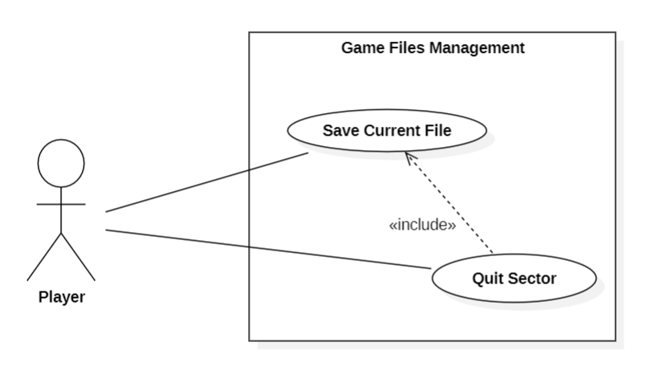
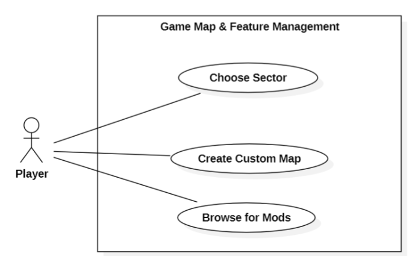

# Use Cases
## Use case: Save Current File
ID:UC6

Specializes: None

Description: The player's current file is saved.

Main Actor: Player

Secondary Actors: None

Pre-conditions: The player is currently playing in a file.

Main Flow:

1. The use case starts when the player chooses the option to save and quit in the current menu.

2. The system prompts the player if they are sure they want to save and quit.

3. Upon confirmation, the system saves the file (sector)'s current state.

4. Include(Quit Sector)

Post-conditions: The player now has its file saved, and is no longer in the sector.

Alternative Flows: None

## Use Case: Quit Sector
ID:UC7

Specializes: None

Description: The player exits its current file (sector) and returns to the main menu.

Main Actor: Player

Secondary Actors: None

Pre-conditions: The player was playing in a file shortly before, which is already saved.

Main Flow:

1. The use case starts when the system is instructed to quit the current sector.

2. Upon confirmation, the system exits the player's file.

3. The system goes back to the main menu, which is displayed to the player

Post-conditions: The player is now in the game's main menu.

Alternative Flows: None

### Use Case Diagram for the Use Cases above:

## Use Case: Choose Sector
ID:UC8

Specializes: None

Description: The player chooses which sector to play in.

Main Actor: Player

Secondary Actors: None

Pre-conditions: The player is currently in the sector selection menu, and has at least one unlocked sector is the current planet.

Main Flow:

1. The use case starts when the player goes to the selection menu.

2. The player moves around the menu and clicks on the location of sector it intends to play in.

3. The system displays the sector's icon, which includes whether the sector is locked/unlocked.

4. If the desired sector is unlocked
    4.1 If the sector has already been played on
        4.1.2 The system displays the player's current resources on the sector, and the player is free to choose it.
    4.2 Else
        4.2.1 The system displays the sector's threat level, and the player is free to choose it.
5. Else
    5.1 The system displays the most recent unlocked sector's information.

Post-conditions: The player is now aware of the availability of the sector it wanted to choose.

Alternative Flows: None

## Use Case: Create Custom Map
ID:UC9

Specializes: None

Description: The player edits a given map to personalize it at its own will.

Main Actor: Player

Secondary Actors: None

Pre-conditions: The player currently has a map open via the editor (the former can be either built-in or manually imported).

Main Flow:

1. The use case starts when the player has a map open from the game's map editor.

2. The system presents several options for customization, which the player can take advantage of.

3. Given its choices, the player customizes its map at will.

Post-conditions: The player now has a (to be saved) custom map.

Alternative Flows: None

## Use Case: Browse for mods
ID:UC10

Specializes: None

Description: The player browses a list of available mods for the game and chooses one for extra details.

Main Actor: Player

Secondary Actors: None

Pre-conditions: The player is currently in the game's built in mod browser, and does not have a concrete mod it wants to search for.

Main Flow:

1. The use case starts when the player goes to the game's mod browser.

2. The system displays a dynamic list of all the available mods.

3. While it has not found a mod, the player keeps scrolling around the browser.

4. The player clicks on the desired mod

5. The system shows information for the mod, which includes the release type and authors.

6. The system also shows options to go back, install, go to the mod's repo and view releases.

Post-conditions: The player now has information on a mod it found interesting, and is able to read it, as well as proceed from there.

Alternative Flows: Display Mods Error Message

## Alternative Flow: Display Mods Error Message
ID:AF10

Specializes: None

Description: The system displays an error message to the player.

Main Actor: Player

Secondary Actors: None

Pre-conditions: The player is currently in the game's built in mod browser.

Alternative Flow:

1. The alternative flow begins on the case 1. of the main flow.

2. Due to an error, namely connection errors, the system displays an error message to the player.

Post-conditions: The player is unable to browse for any mods.

### Use Case Diagram for the last 3 Use Cases:
### 