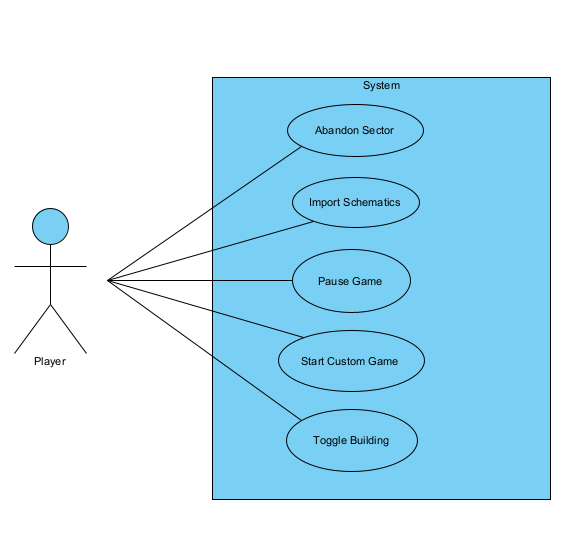

# Use Cases

## Use case diagram: .

### Use case 1: Abandon sector

Description: The player decides to abandon the selected sector, causing its designated core to self-destruct.

Primary actor: Player.

Secondary actor: None.

### Use case 2: Import schematics

Description: The player imports a previously built schematic(blueprint) into the world.

Primary actor: Player.

Secondary actor: None.

### Use case 3: Pause game

Description: The player pauses the game, bringing everything to a halt.

Primary actor: Player.

Secondary actor: None.

### Use case 4: Toggle building

Description: The player stops/resumes automatically building, which allows the user to plan his base.

Primary actor: Player.

Secondary actor: None.

### Use case 5: Start a custom game

Description: The player chooses a map, the game mode and rules that are applied to that save.

Primary actor: Player.

Secondary actor: None.

### Use case diagram
