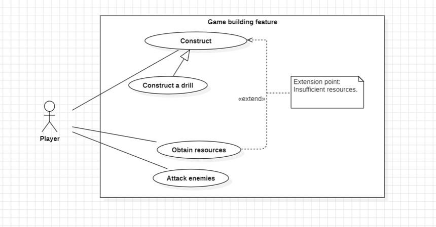
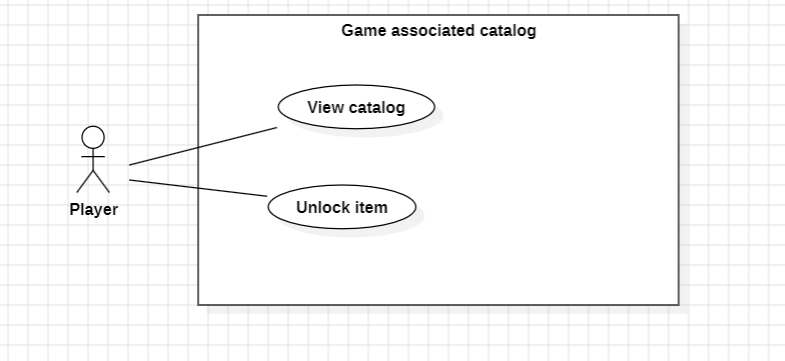

# Use Cases

## Use case: Construct
ID: 1

Description: Construct a structure.

Primary Actors: Player

Secondary Actors: None

Preconditions:
1. The structure must be unlocked (available in the player’s catalog).
2. The player possesses the necessary resources to build.

Main Scenario:
1. The use case begins when the player selects to build a structure.
2. The system dynamically displays a construction position, which can be changed by the player.
3. The player selects the desired position.
4. The system checks if the position is valid.
5. The system starts the construction process.
6. Extension point: Obtain resources - If at any time resources are insufficient, the extension Obtain resources may be invoked.
7. The system updates the resources owned by the player.

Postconditions:
1. The player obtains a new structure.
Alternative Scenarios: Invalid construction position.

## Alternative Flow: Select alternative position – invalid construction position.
UC: 1.1
Description: The system notifies the player that the selected construction position is invalid.

Primary Actors: Player

Secondary Actors: None

Preconditions:
1. The player has selected an invalid construction position.

Alternative Scenario:

1. The alternative scenario begins after step 1 of the main scenario.

2. The system informs the player that an invalid position was selected.

Postconditions: None.

## Use Case: Construct a drill
Use Case: Construct a drill
ID: 6
Especialize: Construct a structure.
Description: The player constructs a drill.

Primary actor: Player

Secondary Actors: None

Preconditions: 
1. The player has the needed resources.

Main flow:
1. (o1.) The use case begins when the player selects to build a structure.
	1.1. The player selects to build a drill.
2. (o2.) The system dynamically displays a construction position, which can be changed by the player.
3. (o3.) The player selects the desired position.
4. (o4.) The system checks if the position is valid.
5. (o5.) The system starts the construction process.
6. (o6.) The system updates the resources owned by the player.

Posconditions: None

## Use Case: Obtain Resources
ID: 2

Description: Obtain new ores.

Primary Actor: Player

Secondary Actors: None

Preconditions:
1. The player is located in a map area containing resources.

Main Scenario:
1. The use case begins when the player emits a "ray" toward an ore.
2. The system collects the resource and updates the player’s inventory.

Postconditions:
1. The player’s catalog is updated with the newly obtained items.
2. Alternative Scenarios: None.

## Use Case: Attack enemies.
ID: 3

Description: Engage in combat with enemies.

Primary Actor: Player

Secondary Actors: None

Preconditions:
1. The enemy is within the player’s attack range.

Main Scenario:
1. The use case begins when the player selects an enemy.
2. The system fires at the enemy.
3. The system removes the enemy from the map.

Postconditions:
1. The enemy disappears from the map.

Alternative Scenarios: None.

## Use Case: View Catalog
ID: 4

Description: The player checks their catalog.

Primary Actor: Player

Secondary Actors: None

Preconditions:
1. The game is running.

Main Scenario:
1. The use case begins when the player clicks on their catalog.
2. The player selects the search criteria.
3. The system displays the catalog view based on the defined criteria.

Postconditions:
1. The player learns the requirements to unlock new items.
Alternative Scenarios: None.

## Use Case: Unlock Item
ID: 5

Description: The player unlocks a new item in the catalog.

Primary Actor: Player

Secondary Actors: None

Preconditions:
1. The game is running.
2. The player possesses the resources required to unlock the item.

Main Scenario:

1. The use case begins when the player clicks on their catalog.
2. Include (View Catalog)
3. The player selects a item to unlock.
4. The system checks if the unlocking requirements are satisfied.
5. If the requirements are met, the system deducts the necessary resources and unlocks the item.

Postconditions:
1. The item becomes available in the player’s catalog (and the player’s resources are updated accordingly).
Alternative Scenarios: None.

