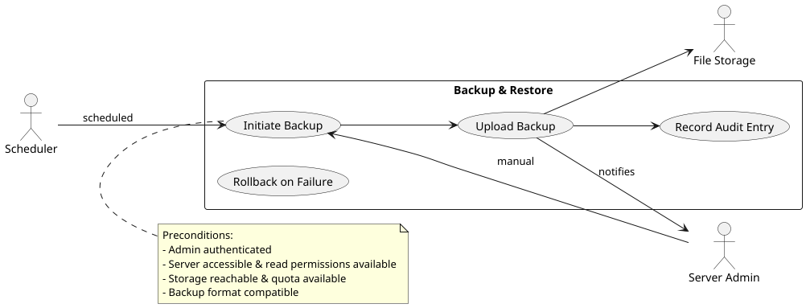

# Use case: Backup Server State (Admin / Server) 
## ID:UC 05

### Description:
Admin or scheduler triggers backups of server state (maps, world, players, config). Backups are stored.

### Actors:
- Primary: Server Admin  
- Secondary: File Storage (cloud), Scheduler

### Pre-conditions
- Admin authenticated.  
- Server accessible and has read permissions.  
- Storage reachable and has space.  
- Backup format compatible or migration tool available.

### Trigger:
- Manual: Admin selects "Backup Now".  
- Automatic: Scheduler runs periodic backup.

### Main Flow:
1. Admin/scheduler starts backup.  
2. Server creates a snapshot.  
3. Backup uploaded to storage.  
4. System records an audit entry.  
5. Admin is notified.  

### Alternative Flows:
Upload fails: system aborts;

Diagram: see `data/ServerAdmin.puml` (and PNG `data/BackupServer.png`).

