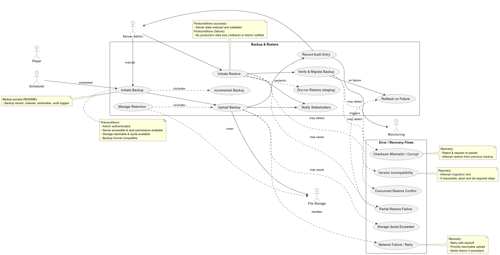

# Use case: Backup & Restore Server State (Admin / Server) 
## ID:UC 05

### Description:
Admin triggers or schedules backups of server state (maps, world, players, config). Backups are stored and can be restored to recover from errors or migrate servers.

### Actors:
- Primary: Server Admin  
- Secondary: File Storage (cloud), Scheduler, Monitoring, Players (notifications)

### Pre-conditions
- Admin authenticated.  
- Server accessible and has read permissions.  
- Storage reachable and has space.  
- Backup format compatible or migration tool available.

### Trigger:
- Manual: Admin selects "Backup Now" or "Restore".  
- Automatic: Scheduler runs periodic backup.

### Main Flow:
1. Admin/scheduler starts backup.  
2. Server creates a consistent snapshot or flushes state.  
3. System computes checksum and (optionally) encrypts backup.  
4. Backup uploaded to storage with metadata.  
5. Storage confirms and system records an audit entry.  
6. Monitoring and Admin are notified.  
7. For restore: Admin selects backup → system verifies, downloads, stops server, restores files, migrates if needed, restarts and verifies.

### Post-conditions:
- Success (backup): backup stored, indexed, retrievable, audit logged.
- Success (restore): server restored and validated.
- Failure: no change to production (or rollback); Admin notified.

### Alternative Flows:
- Incremental backups (store diffs).  
- Snapshot vs quiesce (live snapshot if supported).  
- Retention policies prune old backups.  
- Dry-run restore on staging.

### Common Errors & Recovery:
- Network/upload failure → retry or resume upload.  
- Storage quota exceeded → abort and notify Admin.  
- Corrupted backup (checksum mismatch) → reject and retry or use older backup.  
- Version incompatibility on restore → attempt migration or abort.  
- Concurrent restore → queue or require confirmation.  
- Partial restore failure → rollback to pre-restore snapshot if available.

### Non-functional highlights:
- Atomic operations or rollback support.  
- Encryption in transit and at rest.  
- Replication and retention for durability.  
- Minimal downtime (use incremental/snapshot).  
- Logs/alerts for observability.

### Acceptance Examples:
- Manual backup completes and is retrievable within SLA.  
- Restore succeeds on staging with verification.  
- Errors give clear, actionable messages.

Diagram: see `data/Admin_Server.puml` (and PNG `data/Admin_Server_puml.png`).

