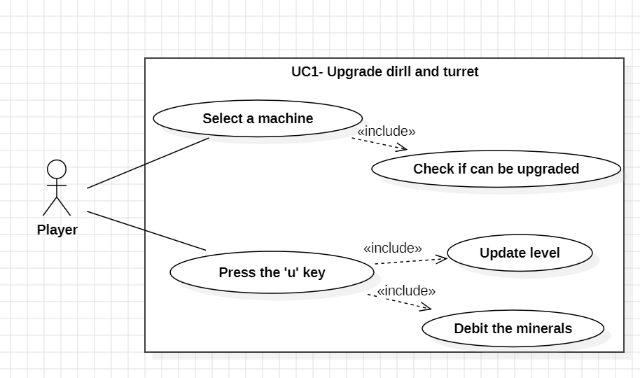
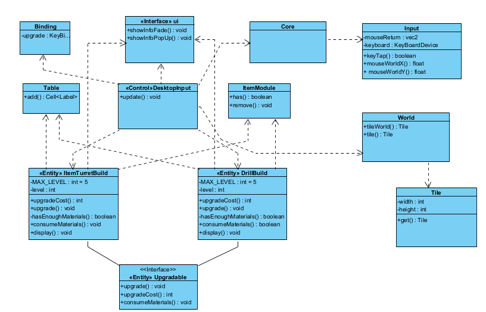
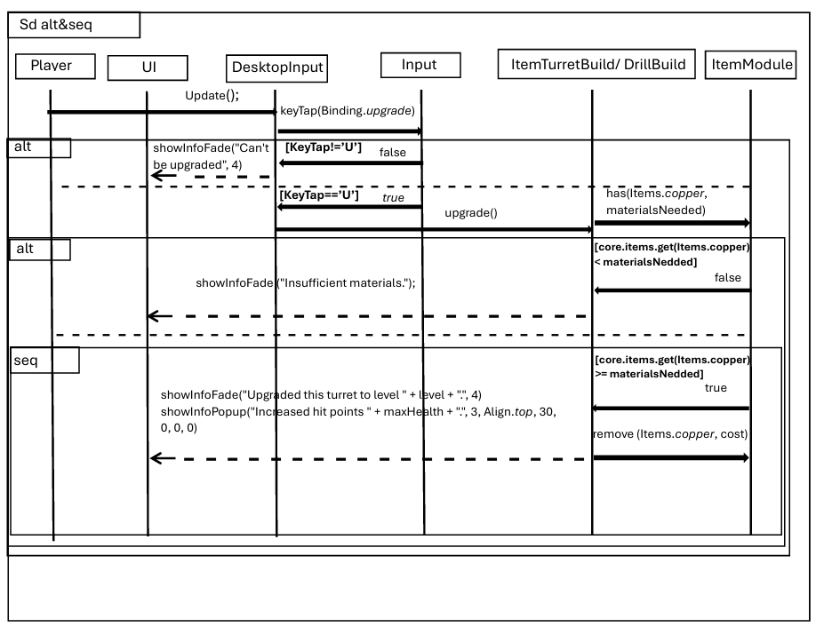
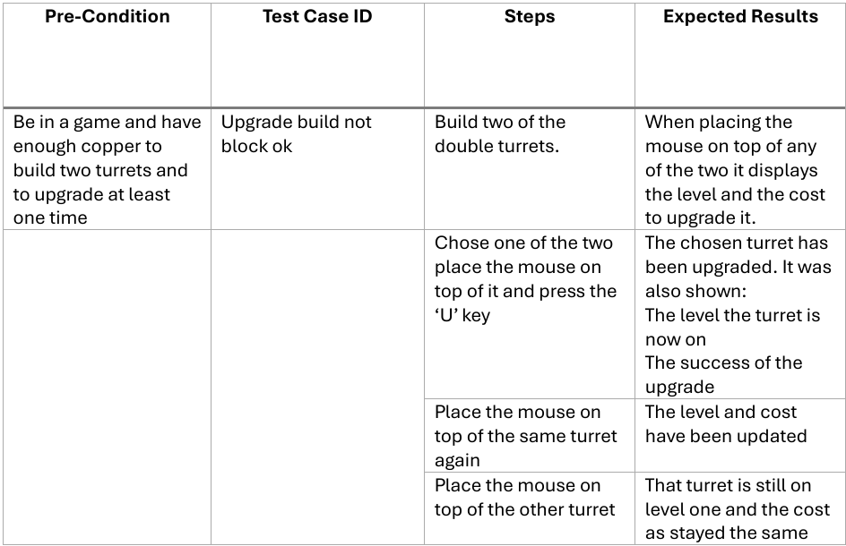
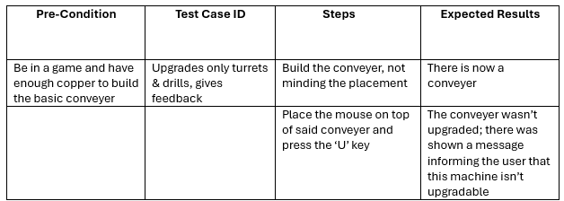
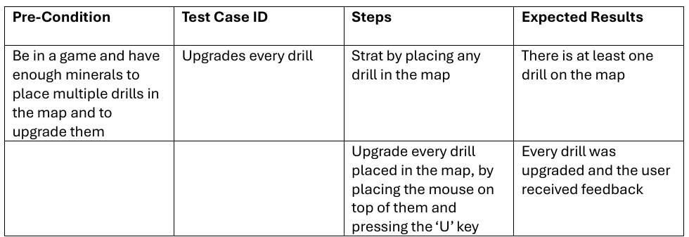

# User story 1

Upgrade Machines

## Author(s)
- Clara Dias (67215)
- Ricardo Batista (68509)
## Reviewer(s)
- Afonso Rodriguez (66565)
- Rafael Soares (70116)
## User Story:
As a Mindustry player, I want to upgrade machines with efficiency levels, so that I can create more resources per time unit in case of drills and other resource generators, and have better defenses in case of weapons.
### Review
A great addition to the game's mechanics, upgrading the machine's efficiency through in-game milestones rewards commited players for their effort and dedication.
A topic of discussion is if these new efficiency levels will be user bound (as in they transit from save to save) or if they are save bound (only available in the save where those milestones were unlocked).
## Use case diagram

## Use case textual description
Name: Upgrade machines- Drill && Turret

### ID: UC1

Description: This use case checks if the player has enough copper to upgrade its machines that have to be a Drill or an ItemTurret
Actors: Player

Primary Actors: Player

Secondary Actors: None

Preconditions: None

Main Scenario:
1.  The use case starts when the player displays the mouse on top of the machine that desires to upgrade.
2. The player presses the 'U' key
3. The system verifies if the selected machine is valid
4. The system calculates the quantity of copper to be debited
5. The system checks if the player has enough copper to upgrade the machine
6. The system debits the copper and upgrade's the machine
7. The system displays a couple of messages about the level to which the machine was updated to, that it has finnished and the uc ends

Post conditions: the health of the Turret was improved and the copper of the player was updated(debited).


Alternative flow:

#### ID: UC 1.1

Description: The machine that was selected can't be upgraded because it doesn't have that capacity.

Preconditions: The player didn't select an ItemTurret nor a drill

Alternative Scenario:
1. The alternative scenario starts after the third step of the main scenario
2. The system informs the player that the machine doesn't have that capacity

3. Post conditions: None


#### ID: UC 1.2

Description: The machine that was selected can't be upgraded because it does not have that capacity.

Preconditions: The player  selected an ItemTurret or a drill that have been totally upgrade.

Alternative Scenario:
1. The alternative scenario starts after the third step of the main scenario
2. The system informs the player that the selected machine is already at its best

Post conditions: None


#### ID: UC 1.3

Description: The player doesn't have enough copper to upgrade the machine

Precondition: The player selected a upgradable, that has not reached the top level and whishes to upgrade that machine but doens't have enough copper

Alternative Scenario:
1. The alternative scenario starts after the third step of the main scenario
2. The system informs the player that there isn't enough copper to upgrade the machine.

Post conditions: None


### Review
*(Please add your use case review here)*
## Implementation documentation



The team started by creating and then implementing the interface Upgradable in the Turret, and that and the keyBind were the starting point of the implementation of this user story.
After that, it was important to develop the consumption of the copper when upgrading the machine, which relies on the ItemModule class to check and consume the items.
Our main preoccupation by then was to find flaws in the implemented code and correct them.
We changed the upgrading to the ItemTurretBuild instead of TurretBuild because that would lead to mistakes and implement upgradable to turrets we didn't want to upgrade.
Before that, the implementation was changed from Turret to TurretBuild, so the upgrade only influences the machine that the player has selected, not all of that type.
After that, we implemented the Upgradable in the DrillBuild.
This implementation only suffered minor changes due to the fact that it was mostly tested before.
The following code snippets are the most important parts of this US implementation and the classes it involves.

#### Code Snippet: ItemTurretBuild

```java

public class ItemTurretBuild extends TurretBuild implements Upgradable {


private final static int MAX_LEVEL = 5; 
private int level = 1;

public int upgradeCost() {
return 2 + 10 * level / MAX_LEVEL;
}

public void upgrade() {
            if (level < MAX_LEVEL) {
                switch (level) {
                    case 1 -> {
                        maxHealth+=100;
                        health +=100;
                    }
                    case 2 -> {
                        maxHealth+=70;
                        health+=70;
                    }
                    case 3 -> {
                        maxHealth+=50;
                        health+=50;
                    }
                    case 4 -> {
                        maxHealth+=30;
                        health+=30;
                    }
                }
                int materialsNeededForUpgrade = upgradeCost();
                if (hasEnoughMaterials(materialsNeededForUpgrade)) {
                    level++;
                    consumeMaterials(materialsNeededForUpgrade);
                    ui.showInfoFade("Upgraded this turret to level " + level + ".", 4);
                    ui.showInfoPopup("Increased hit points " + maxHealth + ".", 3, Align.top, 30, 0, 0, 0);
                }
                else
                    ui.showInfoFade("Insufficient materials.");
            }
            else
                ui.showInfoFade("Already on max level.", 3);
        }


private boolean hasEnoughMaterials(int materialsNeeded) {
            CoreBlock.CoreBuild core = player.core();
            int coreCopper = core.items.get(Items.copper);
            return coreCopper >= materialsNeeded;
        }
        

public void display(Table table) {
            super.display(table);
            table.add("Level: " + level);
        }}
````
* Code Snippet: of the calls to items(ItemModule) - same for Drill and IItemTurret
````java
        private boolean hasEnoughMaterials(int materialsNeeded) {
    CoreBlock.CoreBuild core = player.core();
    return core.items.has(Items.copper, materialsNeeded);
}

public void consumeMaterials(int cost) {
    if (state.rules.mode() != Gamemode.sandbox) {
        CoreBlock.CoreBuild core = player.core();
        if (core != null && core.items.has(Items.copper, cost))
            core.items.remove(Items.copper, cost);
    }
}
````
* Code Snippet: Drill

```java
public void upgrade() {
            if (level < MAX_LEVEL) {
                switch (level) {
                    case 1 -> drillTime -= 40;
                    case 2 -> drillTime -= 30;
                    case 3 -> drillTime -= 20;
                    case 4 -> drillTime -= 10;
                }
                int materialsNeededForUpgrade = upgradeCost();
                if (hasEnoughMaterials(materialsNeededForUpgrade)) {
                    level++;
                    consumeMaterials(materialsNeededForUpgrade);
                    ui.showInfoFade("Upgraded this drill to level " + level + ".", 4);
                    ui.showInfoPopup("Decreased drill time to " + drillTime + ".", 3, Align.top, 30, 0, 0, 0);
                } else
                    ui.showInfoFade("Insufficient materials.");
            }
            else
                ui.showInfoFade("Already on max level.", 3);
        }
  ````
* Code Snippet: DesktopInput

```java
  if (Core.input.keyTap(Binding.upgrade)) {
  Tile selected = world.tileWorld(input.mouseWorldX(), input.mouseWorldY());
  Building build = selected.build;

  if (build instanceof ItemTurret.ItemTurretBuild t)
    t.upgrade();
  else if (build instanceof Drill.DrillBuild d)
    d.upgrade();
  else
    ui.showInfoFade("Can't be upgraded", 4);
}
````

### Implementation summary

The US1 was developed, so that the player can upgrade the machines - Drill and ItemTurret -
while playing, it does not save the upgraded version of the machine, this way the player, when in difficulty,
can upgrade this machines and leading to better outputs. We implemented the code in the following classes:
- Drill
- ItemTurret
- DesktopInput
- developed a new interface - Upgradable
- Biding

We start by implementing the extended interface in the class turret,
that correspond to the following commit b981aa8.
Followed by:
- Developing a keyBind for the action, that correspond to the following commit (b9c5e9c);
- Implementing the debit of the minerals when the machine was upgraded, that correspond to the following commit (74f3c6e);
- Implementing the upgrade in the Drill class, that corresponds to the following commit (a93109e);
- Added the graphic part, that reveals to the player what's the level that the machine is on, that corresponds to the following commit (2d710a2);
- Added small outputs so the user always as feedback, that corresponds to the following commit (d750a2b).
- The last commit (b6c5272) corresponds to small corrections when it comes to the method hasEnoughMaterials, present in both DrillBuild and ItemTurretBuild Classes


#### Review
*(Please add your implementation summary review here)*
### Class diagrams

![ClassDiagram.png]!(ClassDiagram.png)

This class diagram represents the changes we made in the code and how the classes interact.
In this class diagram are represented the classes that we actually made changes to and the classes that we needed to make everything functional.
The action starts in the Input class, which senses if the 'U' key has been pressed.
If so, then the DesktopInput checks if the build selected — the build is selected through the method tileWorld from the World class with the X and Y coordinates (Input class) — is an instance of either an ItemTurretBuild or a DrillBuild.
If so, the method upgrade is called from either class; if not, the class UI is called with the mission to tell the user that the build selected is not upgradable.
### Review
*(Please add your class diagram review here)*
### Sequence diagrams

* This sequence diagram represents the use story 1, and in which order this actions occur.
* We have the 2 different alt fragments, which represent the alternative paths the program can follow depending on whether the selected build is upgradable or not and has enough copper or not.
* There is also a seq fragment that obliges the flow to happen in that specific order.
#### Review
*(Please add your sequence diagram review here)*
## Test specifications



These are the tests that were created and tested for the user story 1 implementation.
Each test was designed to verify a specific part of the upgrade logic implemented.
We filmed a video where we demonstrated our implementation, showing the expected behavior in the game environment and 
confirming that the upgrade process, the copper consumption, and the user feedback all function correctly.
This video serves as evidence that the user story was fully implemented and validated through practical testing.


link: https://youtu.be/Ea53YZtPJes
### Review
*(Please add your test specification review here)*
