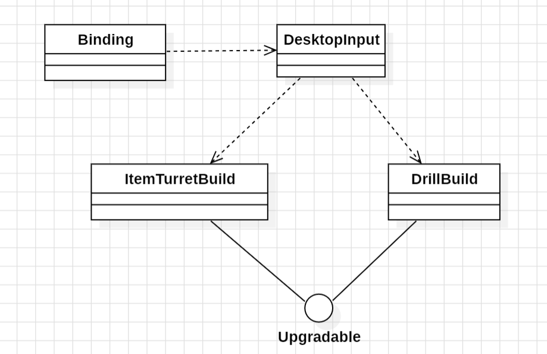
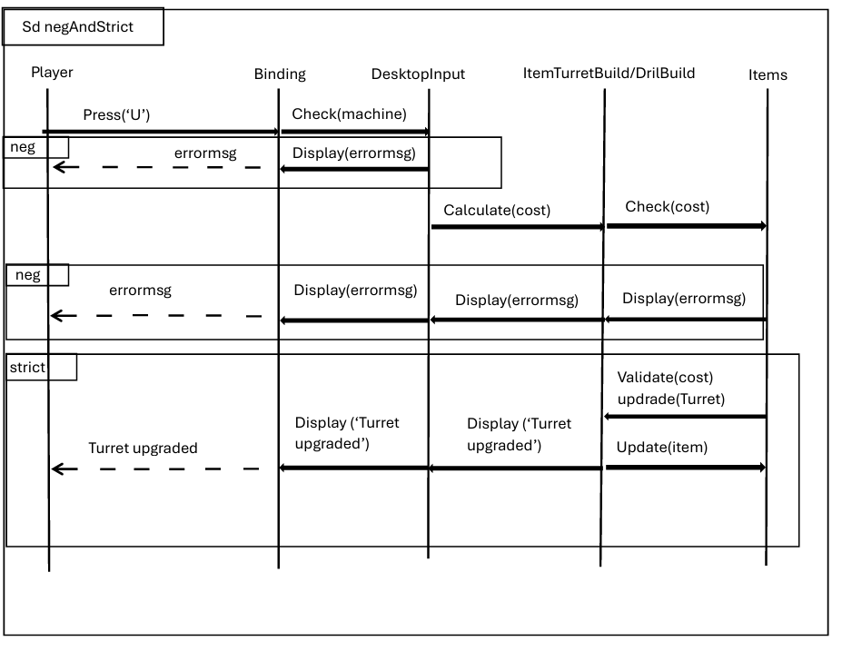

# User story 1

Upgrade Machines

## Author(s)
- Clara Dias (67215)
- Ricardo Batista (68509)
## Reviewer(s)
- Afonso Rodriguez (66565)
- Rafael Soares (70116)
## User Story:
As a Mindustry player, I want to upgrade machines with efficiency levels, so that I can create more resources per time unit in case of drills and other resource generators, and have better defenses in case of weapons.
### Review
A great addition to the game's mechanics, upgrading the machine's efficiency through in-game milestones rewards commited players for their effort and dedication.
A topic of discussion is if these new efficiency levels will be user bound (as in they transit from save to save) or if they are save bound (only available in the save where those milestones were unlocked).
## Use case diagram

## Use case textual description
Name: Upgrade machines- Drill && Turret

### ID: UC1

Description: This use case checks if the player has enough copper to upgrade its machines that have to be a drill or a double turret
Actors: Player

Primary Actors: Player

Secondary Actors: None

Preconditions: None

Main Scenario:
1.  The use case starts when the player displays the mouse on top of the machine that desires to upgrade.
2. The player presses the 'U' key
3. The system verifies if the selected machine is valid
4. The system calculates the quantity of copper to be debited
5. The system checks if the player has enough copper to upgrade the machine
6. The system debits the copper and upgrade's the machine
7. The system displays a couple of messages about the level to which the machine was updated to, that it has finnished and the uc ends

Post conditions: the health of the Turret was improved and the copper of the player was updated(debited).


Alternative flow:

#### ID: UC 1.1

Description: The machine that was selected can't be upgraded because it doesn't have that capacity.

Preconditions: The player didn't select a double Turret nor a drill

Alternative Scenario:
1. The alternative scenario starts after the third step of the main scenario
2. The system informs the player that the machine doesn't have that capacity

3. Post conditions: None


#### ID: UC 1.2

Description: The machine that was selected can't be upgraded because it doesn't have that capacity.

Preconditions: The player  selected a Double turret or a drill that have been totally upgradede

Alternative Scenario:
1. The alternative scenario starts after the third step of the main scenario
2. The system informs the player that the selected machine is alredy at its best

Post conditions: None


#### ID: UC 1.3

Description: The player doesn't have enough copper to upgrade the machine

Precondition: The player selected a upgradable, that has not reached the top level and whishes to upgrade that machine but doens't have enough copper

Alternative Scenario:
1. The alternative scenario starts after the third step of the main scenario
2. The system informs the player that there isn't enough copper to upgrade the machine.

Post conditions: None


### Review
*(Please add your use case review here)*
## Implementation documentation
(*Please add the class diagram(s) illustrating your code evolution, along with a technical description of the changes made by your team. The description may include code snippets if adequate.*)


The team started by implementing the interface Upgradable, in the Turret, that and the keyBind were the starting point of the implementation of this user story.
After that it was important to develop the consuming of the copper, when upgrading the machine. After the main part was implemented we started to try and find 
mistakes and correct them. Given some mistakes, we changed the upgrading to the ItemTurretBuild, so it only influences the machine that the player has selected 
not all of that type. After that we were to implement correctly the Upgradable in the DrillBuild. 
The following code Snippets, are the most important parts of this us implementation.

#### Code Snippet: ItemTurretBuild

```java

public class ItemTurretBuild extends TurretBuild implements Upgradable {


private final static int MAX_LEVEL = 5; 
private int level = 1;

public int upgradeCost() {
return 2 + 10 * level / MAX_LEVEL;
}

public void upgrade() {
            if (level < MAX_LEVEL) {
                switch (level) {
                    case 1 -> {
                        maxHealth+=100;
                        health +=100;
                    }
                    case 2 -> {
                        maxHealth+=70;
                        health+=70;
                    }
                    case 3 -> {
                        maxHealth+=50;
                        health+=50;
                    }
                    case 4 -> {
                        maxHealth+=30;
                        health+=30;
                    }
                }
                int materialsNeededForUpgrade = upgradeCost();
                if (hasEnoughMaterials(materialsNeededForUpgrade)) {
                    level++;
                    consumeMaterials(materialsNeededForUpgrade);
                    ui.showInfoFade("Upgraded this turret to level " + level + ".", 4);
                    ui.showInfoPopup("Increased hit points " + maxHealth + ".", 3, Align.top, 30, 0, 0, 0);
                }
                else
                    ui.showInfoFade("Insufficient materials.");
            }
            else
                ui.showInfoFade("Already on max level.", 3);
        }


private boolean hasEnoughMaterials(int materialsNeeded) {
            CoreBlock.CoreBuild core = player.core();
            int coreCopper = core.items.get(Items.copper);
            return coreCopper >= materialsNeeded;
        }

public void consumeMaterials(int cost) {
            if (state.rules.mode() != Gamemode.sandbox) {
                CoreBlock.CoreBuild core = player.core();
                if (core != null && core.items.has(Items.copper, cost))
                    core.items.remove(Items.copper, cost);
            }
        }

public void display(Table table) {
            super.display(table);
            table.add("Level: " + level);
        }
````

* Code Snippet: Drill

```java
  public void upgrade() {
  if (level < MAX_LEVEL) {
  switch (level) {
  case 1 -> drillTime -= 40;
  case 2 -> drillTime -= 30;
  case 3 -> drillTime -= 20;
  case 4 -> drillTime -= 10;
  }
  ...
  }
  ````
* Code Snippet: DesktopInput

```java
  if (Core.input.keyTap(Binding.upgrade)) {
  Tile selected = world.tileWorld(input.mouseWorldX(), input.mouseWorldY());
  Building build = selected.build;

if (build instanceof ItemTurret.ItemTurretBuild t)
    t.upgrade();
else if (build instanceof Drill.DrillBuild d)
    d.upgrade();
else
    ui.showInfoFade("Can't be upgraded", 4);
}
````

### Implementation summary
(*Summary description of the implementation.*)

The US1 was developed, so that the player can upgrade the machines - drill and double turret - 
while playing, it does not save the upgraded version of the machine, this way the player, when in difficulty,
can upgrade this machines and leading to better outputs. We implemented the code in the following classes:
- Drill
- ItemTurret
- DesktopInput
- developed a new interface - Upgradable
- Biding

We start by implementing the extended interface in the class turret,
that correspond to the following commit b981aa8.
Followed by:
- Developing a keyBind for the action, that correspond to the following commit (b9c5e9c);
- Implementing the debit of the minerals when the machine was upgraded, that correspond to the following commit (74f3c6e);
- Implementing the upgrade in the Drill class, that corresponds to the following commit (a93109e);
- Added the graphic part, that reveals to the player what's the level that the machine is on, that corresponds to the following commit (2d710a2);
- Added small outputs so the user always as feedback, that corresponds to the following commit (d750a2b).


#### Review
*(Please add your implementation summary review here)*
### Class diagrams
(*Class diagrams and their discussion in natural language.*)

This class diagram, represents the changes we made in the code and how the classes interact. The DesktopInput class depends on the
Binding one, because there is only an action, in this user story, if the player presses the 'U' key.

### Review
*(Please add your class diagram review here)*
### Sequence diagrams

* This sequence diagram represents the use case 1, and in which order this actions occur.
* We have the strict sequence, so the operands always have to follow this sequence.
* There is also a neg sequence that happens when there is a problem, we are not in the main flow.

#### Review
*(Please add your sequence diagram review here)*
## Test specifications
(*Test cases specification and pointers to their implementation, where adequate.*)
### Review
*(Please add your test specification review here)*
