# User story 2
New warning icon for misplaced conveyors and congestion.

## Author(s)
- Raksana Udagedara (67196)
- Guilherme Neto (68663)
## Reviewer(s)
- Clara Dias (67215)
- Ricardo Batista (68509)
## User Story:
**As a** player that likes to keep track of everything, **I want to** receive a text warning everytime I misplace a conveyor for whatever reason and obtain possible fixes, **so that** I can have everything under my watch and build solid structures quickly.
### Review
This addition has great potential, mainly because for new players, conveyor misplacements and poor assemblies may not be obvious at first. It’s important to be careful so that the game’s interface doesn’t become too cluttered with excessive information.
## Use case diagram


## Use case textual description

## Use Case: Place misplaced conveyor.

**ID:** 1

**Description:** The player places a conveyor with inconsistent rotation in relation to a previously placed conveyor.

**Primary actor:** player.

**Secondary actor:** none.

**Preconditions:**

1. The player is aligning conveyors.

**Main flow:**

1. The use case begins when the player places a conveyor with inconsistent rotation relative to a previously placed conveyor.
2. The system alerts the player by displaying a warning icon on the misplaced conveyor.

**Postconditions:**

1. The system displays the error icon on the misplaced conveyors.

**Alternative flows:** none.

## Use Case: Cause congestion.

**ID:** 2

**Description:** The player causes congestion in the circulation of items on the conveyors.

**Primary actor:** player.

**Secondary actor:** none.

**Preconditions:**

1. The player places a drill that puts ores into circulation on the conveyors.

**Main flow:**

1. The use case begins when the circulation of items on the conveyors stops.
2. The system alerts the player by displaying a congestion warning icon.

**Postconditions:**

1. The system displays the error icon at the location of the congestion.

**Alternative flows:** none.

## Use Case: Obtain error details.

**ID:** 3

**Description:** The player sees an error icon and checks its description.

**Primary actor:** player.

**Secondary actor:** none.

**Preconditions:**

1. The player has placed at least one conveyor with an inconsistent rotation relative to a preceding conveyor/there is congestion on the conveyors.
2. The system alerts the player by displaying an icon in the associated location.

**Main flow:**

1. The use case begins when the player clicks on the error icon.
2. The system displays a window identifying the error and suggesting a solution.

**Postconditions:**

1. The player is in the window displaying the reason for the error and the suggested solution.

**Alternative flows:** none.

## Use Case: Confirm error acknowledgment.

**ID:** 4

**Description:** The player clicks “OK” to exit the window that identifies the error/suggestion.

**Primary actor:** player.

**Secondary actor:** none.

**Preconditions:** 

1. The player has placed at least one conveyor with an inconsistent rotation relative to an immediately preceding conveyor/there is congestion on the conveyors.
2. The system alerts the player by displaying an icon in the associated location.
3. The player is in the window that identifies the error/suggestion.

**Main flow:** 

1. The use case begins when the player clicks “OK” to exit the window.
2. The system exits the error/suggestion identification window.

**Postconditions:**

1. The game resumes.

**Alternative flows:** none.


## Use Case: Error resolution.

**ID:** 5

**Description:** The player resolves incorrectly placed conveyors/congestion.

**Primary actor:** player.

**Secondary actor:** none.

**Preconditions:**

1. There is at least one error.

**Main flow:**

1. The use case begins when the player resolves the error by placing the associated conveyors in the correct position or resolving the congestion.
2. The system stops displaying the error icon.

**Postconditions:** 

1. The error icon disappears.

**Alternative flows:** none.

## Use Case: Consult log.

**ID:** 6

**Description:** The player clicks on the menu icon associated with the log.

**Primary actor:** player.

**Secondary actor:** none.

**Preconditions:**

1. Log icon available in the menu.

**Main flow:**

1. The use case begins when the player clicks on the log icon.
2. The system displays the warnings present in the log.
Extension Point: Clear fixed warnings.

**Postconditions:** 

1. The player is in the log window.

**Alternative flows:** none.

## Use Case: Clear fixed warnings.

**ID:** 7

**Description:** The player clicks on the button that removes warnings associated with fixed issues.

**Primary actor:** player.

**Secondary actor:** none.

**Preconditions:**

1. Log icon available in the menu.
2. There are errors that have already been fixed (error icon is no longer present).

**Main flow:**

1. The use case begins when the player selects the option to delete warnings associated with resolved errors from the log.
2. The system informs the player that the fixed warnings have been removed.
3. The system updates the log, leaving only warnings associated with unfixed errors.

**Postconditions:**

1. Log is updated.

**Alternative flows:** No fixed warnings.

## Alternative flow: No fixed warnings.

**ID:** 7.1

**Description:** The system informs the player that he has not fixed/has no warnings to fix in the log.

**Primary actor:** player.

**Secondary actor:** none.

**Preconditions:**

1. Log with no fixed warnings or warnings to fix.

**Main flow:**

1. The alternative scenario begins after step 1 of the main scenario.
2. The system informs the player that there are no fixed warnings to remove.

**Postconditions:** none.


## Use Case: Close log.

**ID:** 8

**Description:** The player clicks on the button to close the log.

**Primary actor:** player.

**Secondary actor:** none.

**Preconditions:** 

1. The player is on the window that displays the log information.

**Main flow:**

1. The use case begins when the player clicks the button to close the log.
2. The system closes the log.

**Postconditions:**

1. The game resumes.

**Alternative flows:** none.

### Review
*(Please add your use case review here)*
## Implementation documentation

For the implementation of user story 2, the subgroup held meetings to plan and develop the code associated with the proposed extension. During this process, we created two new classes: Warning and ConveyorLog, and added and/or changed methods in the classes: UI, DesktopInput, Conveyor.ConveyorBuild.

To achieve the goal, the team encountered the following requirements: 
- identification of misplacing errors/congestion and draw the icon in the correct places;
- add a new button to the interface for the conveyor log; 
- add the warnings associated with the errors identified in the log;
- allow the player to interact with the log by creating mechanisms for it.

Below we present the associated code snippets, and in the implementation summary section we explain each one in more detail, associating them with the commits made in the repository.

## Code snippets

## Warning.java
### Location: `core/src/mindustry/world/blocks/distribution/Warning.java`

````java

package mindustry.world.blocks.distribution;

public class Warning {

    protected static final String MISPLACED_TYPE = "misplaced";
    protected static final String MISPLACED_MESSAGE = "There appears to be a misplaced conveyor!\n\n Try changing your conveyor's direction or place a router.";
    protected static final String CONGESTED_TYPE = "congested";
    protected static final String CONGESTED_MESSAGE = "There appears to be clogging in your conveyor line!\n\n Try adding a destination, like a turret or your core.";

    private String message;
    private boolean isFixed;
    private String type;
    private float x;
    private float y;


    public Warning(String type, String message, float x, float y) {
        this.message = message;
        this.isFixed = false;
        this.type = type;
        this.x = x;
        this.y = y;
    }

    public String getMessage() {
        return message;
    }

    public float getX() {
        return this.x;
    }

    public float getY() {
        return this.y;
    }

    public String getCoordinates() {
        return ("(x = " + this.x + " y = " + this.y + ")");
    }

    public void switchFixed() {
        isFixed = !isFixed;
    }

    public boolean isFixed() {
        return isFixed;
    }

    public String isFixedToString() {
        if (this.isFixed) {
            return "Fixed";
        }
        return "Not Fixed";
    }

    public String getType() {
        return type;
    }


    @Override
    public boolean equals(Object other) {
        if (this == other) return true;
        if (other == null || getClass() != other.getClass()) return false;
        Warning warning = (Warning) other;
        return this.getType().equals(warning.getType()) &&
                this.getCoordinates().equals(warning.getCoordinates());
    }

    @Override
    public int hashCode() {
        return (int)(this.getX() * this.getY() * 2);
    }
}

````

## ConveyorLog.java
### Location: `core/src/mindustry/world/blocks/distribution/ConveyorLog.java`
````java
package mindustry.world.blocks.distribution;
import java.util.Iterator;
import java.util.Set;
import java.util.HashSet;

import static mindustry.Vars.ui;

public class ConveyorLog {
    private static final String IS_EMPTY = "There are currently no warnings in the log.";
    public static final String NO_CLEARED_WARNINGS = "There are no warnings to be cleared!";
    private static final String WARNING_INFO = "Type: %s\t   Location: %s\n\n";
    public static final String CLEAR_MESSAGE = "All fixed warnings cleared";
    private static final int MAX_WARNINGS = 15;
    private static final int TILE_SIZE = 8;
    private Set<Warning> warnings;
    private static ConveyorLog instance = null;


    public ConveyorLog() {
        this.warnings = new HashSet<>();
    }

    public static ConveyorLog getInstance() {
        if (instance == null) {
            instance = new ConveyorLog();
        }
        return instance;
    }

    private boolean doesSimilarExistExist(Warning warning, Warning other) {
        return ((warning.getX() == other.getX() && warning.getY() - other.getY() == TILE_SIZE) || (warning.getY() == other.getY() && warning.getX() - other.getX() == TILE_SIZE) ||
                (warning.getX() == other.getX() && warning.getY() - other.getY() == -TILE_SIZE) || (warning.getY() == other.getY() && warning.getX() - other.getX() == -TILE_SIZE));
    }

    public void addWarning(Warning warning) {
        boolean canAdd = true;
        for(Warning w : warnings) {
            if(doesSimilarExistExist(warning, w)) {
                canAdd = false;
            }
        }
        if (canAdd) {
            warnings.add(warning);
        }
    }


    public void removeFixed() {
        for (Warning w : warnings) {
            if(w.isFixed()) {
                warnings.remove(w);
            }
        }
    }

    public int getNumberOfWarnings() {
        return warnings.size();
    }

    public void removeAll() {
        warnings.clear();
    }

    public void printLog(){
        if (warnings.isEmpty()) {
            ui.showConveyorLog(IS_EMPTY);
        } else {
            String allWarnings = "";
            int i = 0;
            Iterator<Warning> it = warnings.iterator();
            while(i++ < MAX_WARNINGS &&  it.hasNext()) {
                Warning w = it.next();
                allWarnings = allWarnings.concat(String.format(WARNING_INFO, w.getType(), w.getCoordinates(), w.isFixedToString()));
            }
            ui.showConveyorLog(allWarnings);

        }
    }

}

````

## ConveyorBuild.java
### Location: `core/src/mindustry/world/blocks/distribution/Conveyor.java`

````java

        public void draw(){
		//(…) 
            detectError();
        }

       private void showErrorSuggestion(Float x, Float y, Warning warning){
            if (didPlayerClick(x,y) && !openMenu) {
                openMenu = true;
                state.set(GameState.State.paused);
                switch(warning.getType()){
                    case (Warning.CONGESTED_TYPE):
                        ui.showInfoWarning(Warning.CONGESTED_MESSAGE, this);
                        break;
                    case (Warning.MISPLACED_TYPE):
                        ui.showInfoWarning(Warning.MISPLACED_MESSAGE, this);
                        break;
                }
            }
        }

        public void setFalse(){
            openMenu = false;
        }

        private void detectErrorAux(TextureRegion error, float x, float y, Warning warning) {
            showErrorSuggestion(x, y, warning);
            Draw.rect(error, x, y, tilesize, tilesize);
            log.addWarning(warning);
        }

        private void detectError(){
            Warning warning = new Warning(Warning.MISPLACED_TYPE, Warning.MISPLACED_MESSAGE, x, y);
            TextureRegion error = Core.atlas.find("error");
            if(!aligned && (nextc != null && !nextc.aligned)){
                if(rotation != nextc.rotation){
                    int orientation = rotation - nextc.rotation;
                    if(orientation % 2 == 0 ){
                        float errorX =(x + nextc.x)/2;
                        float errorY = (y + nextc.y)/2;
                        detectErrorAux(error, errorX, errorY, warning);
                    }
                }
                return;
            }
            if(nextc == null && !shouldAmbientSound()){
                warning = new Warning(Warning.CONGESTED_TYPE, Warning.CONGESTED_MESSAGE, x, y);
                detectErrorAux(error, x, y, warning);
            }
        }

        private boolean didPlayerClick(float x , float y) {
            return (
                    Core.input.mouseWorldX() >= x - tilesize/2.0f
                            && Core.input.mouseWorldX() <= x + tilesize/2.0f
            )
                    && (
                    Core.input.mouseWorldY() >= y - tilesize/2.0f
                            && Core.input.mouseWorldY() <= y + tilesize/2.0f
            )
                    && Core.input.keyTap(KeyCode.mouseLeft);
        }


````

## DesktopInput.java
### Location: `core/src/mindustry/input/DesktopInput.java`

````java

public void buildPlacementUI(Table table){
	//(…)

        table.button(Icon.file, Styles.clearNonei, () -> {
            ui.conveyorLog.printLog();
        }).tooltip("Warning Log");

	//(…)
    }

````

## UI.java
### Location: `core/src/mindustry/core/UI.java`

````java

    public void showInfoWarning(String info, Conveyor.ConveyorBuild conveyor){
        new Dialog(""){{
            getCell(cont).growX();
            cont.margin(15).add(info).width(400f).wrap().get().setAlignment(Align.center, Align.center);
            buttons.button("@ok", () -> {
                player.shooting = false;
                state.set(GameState.State.playing);
                this.hide();
                conveyor.setFalse();

            }).size(110, 50).pad(4);

        }}.show();
    }

    public void showConveyorLog(String info) {
        new Dialog("                      Conveyor Log\n"){{
            getCell(cont).growX();
            cont.margin(0).add(info).width(400f).get().setAlignment(Align.top, Align.center);
            buttons.button("Exit Log", this::hide).size(110, 50).pad(4);
            buttons.button("Clear Fixed", () ->{
                ui.showInfoFade(conveyorLog.getNumberOfWarnings() == 0 ? ConveyorLog.NO_CLEARED_WARNINGS : ConveyorLog.CLEAR_MESSAGE);
                conveyorLog.removeAll();
                this.hide();
            }).size(110, 50).pad(4);
            keyDown(KeyCode.enter, this::hide);
            closeOnBack();
        }}.show();
    }

````

### Implementation summary
As mentioned earlier, our implementation involved creating two new classes (Warning and ConveyorLog) and modifying existing classes (UI, DesktopInput, and Conveyor).

The following commits were made to the repository:

- commit (792e508): concerns the Warning class (implemented in core/src/mindustry/world/blocks/distribution/Warning.java). This class is used to represent a Warning type object that stores information about conveyor congestion/misplacing errors, namely the position where the error occurs.

- commit (363bd59): refers to the ConveyorLog class (core/src/mindustry/world/blocks/distribution/ConveyorLog.java), which represents the object that stores warnings in the game i.e., errors not yet resolved by the player and the ones that were fixed but not cleared (it is like a browser history).

- commit (ae81754): consists of an addition to the ConveyorLog class (printLog method) that allows us to display the warnings present in the log.

- commit (0bd07d0): refers to the addition of a new button to the game interface, more precisely in the menu area, where we now have a button to access the Log. For this, we changed the buildPlacementUI method of the DesktopInput class (core/src/mindustry/input/DesktopInput.java).

- commit (02ff140): allows us to display the warnings present in the log. To achieve this goal, the showConveyorLog method was added to the UI class (core/src/mindustry/core/UI.java).

- commit (94731b5): refers to the addition to the Conveyor class (core/src/mindustry/world/blocks/distribution/Conveyor.java), more precisely to the inner class ConveyorBuild of the showErrorSuggestion, didPlayerClick, and setFalse methods. These methods allow the player to click on the error and see a message identifying the cause of the error as well as a suggested solution.

- commit (ab7f320): refers to the UI class (core/src/mindustry/core/UI.java) and is associated with the previous commit. It consists of adding the showInfoWarning method, which allows the information to be displayed, as well as the “OK” button that allows the player to exit the window showing the information/suggestion associated with the error.

- commit (ce79037): refers to the Conveyor class, more specifically ConveyorBuild and consists of adding the detectError method used in the draw method of the same class, which allows us to draw and display the error icon in the associated locations. This method uses others previously mentioned, maintaining a logical alignment of the identification process and associated display.

The commits done later were associated with the code smells identified in ConveyorBuild class and the existence of a singleton pattern in our ConveyorLog class.


#### Review
*(Please add your implementation summary review here)*

### Class diagram

The class diagram represents the implementation done in the source code, summarizing it and illustrating the classes where the changes were made, as well as the ones that were important for the implementation.


The interaction between the player and the interface begins when the player selects to place a conveyor on the map (drawn using the rect method of the Draw class). If an error occurs (detected by the detectError method), a new icon is drawn. In addition, a warning is created and added to the game log. A new button has been added to the menu to allow the player to access the log through the interface.

### Review
*(Please add your class diagram review here)*

### Sequence diagrams

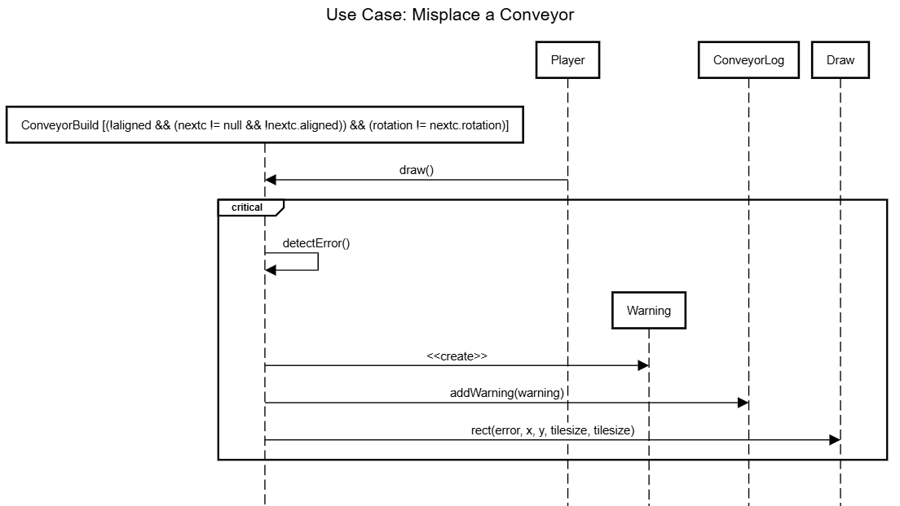

#### The sequence diagram above describes the user misplaying a conveyor: the player places the conveyor, specifically a misplaced one, as labeled by the condition, which creates a warning and draws the error. The latter cannot be interrupted.


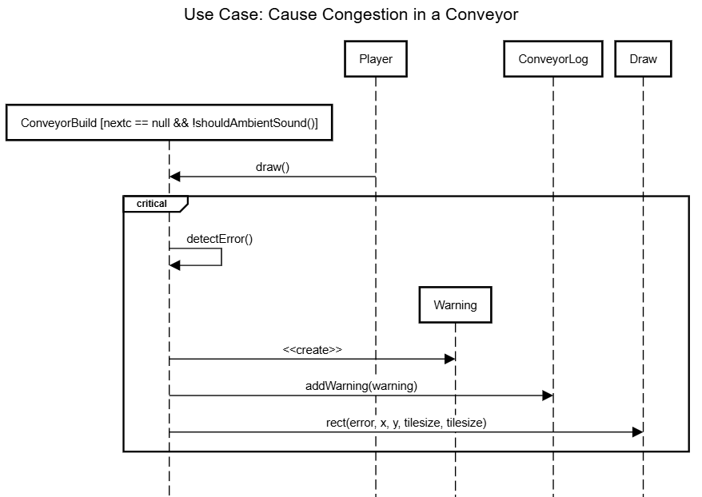

#### The sequence diagram above describes the user misplaying a conveyor: the player places the conveyor, specifically a misplaced one, as labeled by the condition, which creates a warning and draws the error. The latter cannot be interrupted.


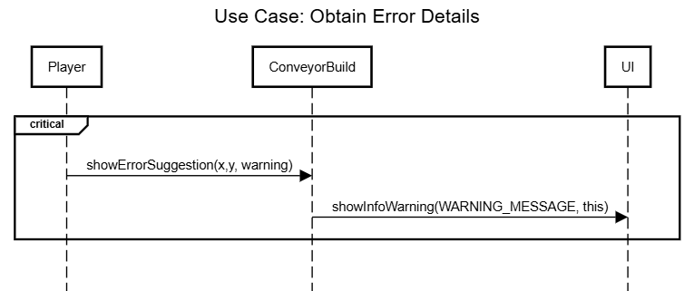

#### The sequence diagram above describes the user clicking on a warning's icon to obtain more information about it: by doing so, the player interacts with the `ConveyorBuild`, which in turn makes a call to `UI`. The action cannot be interrupted.


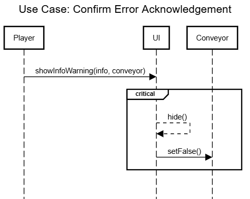

#### The sequence diagram above describes the user clicking on the OK button while on the warning screen: The player directly interacts with the UI, which hides the menu and changes a flag that represents whether the menu is open.


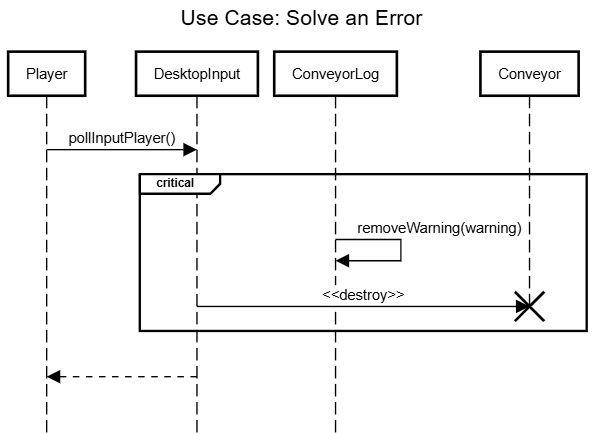

#### The sequence diagram above describes the user fixing an existing error/warning in the conveyors, either by following the suggested solutions or by simply removing the conveyor. The Conveyor is always destroyed or updated.


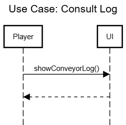

#### The sequence diagram above describes the user clicking on the log button in the menu in order to consult it. This consists in a simple showing action from the UI.


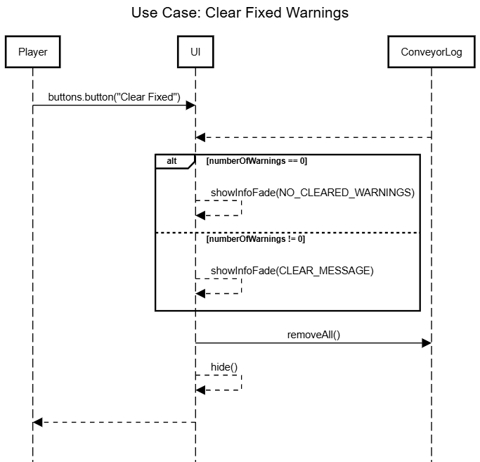

#### The sequence diagram above describes the user clearing all the existing warnings in the Conveyor Log. The message shown depends on whether the player has any warnings in the log at the time the button is pressed.


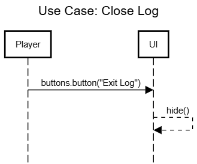

#### The sequence diagram above describes the user exiting the Conveyor Log. It simply consists in the UI being hidden due to an interaction from a the player.

#### Review
*(Please add your sequence diagram review here)*
## Test specifications

### USER STORY #2 : TESTS

To test all of these functionalities, the player must be (or have been) in a gamemode that supports conveyors (either Campaign in Serpulo or Sandbox in any map). Although the log works on Erekir, no warnings will be shown, as there are no conveyors in said planet.


**NOTE: Each test's title is a clickable link to a YouTube video containing a visual explanation.**

### [TEST #1:](https://youtu.be/PCIbglmwM6s)

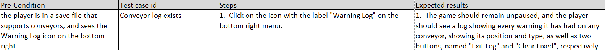

This test is meant to check if the conveyor log is present.

#### Pre-Condition: the player opens a save file (sector) in any built-in gamemode or map.
#### Test Case ID: Conveyor log exists

#### Steps:

1.  Launch Mindustry.
2.  Open the game in any sector/save file/map.

#### Expected Results:

1.  The player sees a new icon, labeled Warning Log, on the bottom right, together with Schematics, Core Database, Research and Planet Map.


### [TEST #2:](https://youtu.be/qNW3VyAqnb4)

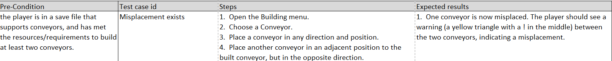

This test is meant to check if a misplaced conveyor successfully outputs a warning.

#### Pre-Condition: the player is in a save file that supports conveyors, and has met the resources/requirements to build at least two conveyors.
#### Test Case ID: Misplacement exists

#### Steps:

1.  Open the Building menu.
2.  Choose a Conveyor.
3.  Place a conveyor in any direction and position.
4.  Place another conveyor in an adjacent position to the built conveyor, but in the opposite direction.

#### Expected Results:

1.  One conveyor is now misplaced. The player should see a warning (a yellow triangle with a ! in the middle) between the two conveyors, indicating a misplacement.


### [TEST #3:](https://youtu.be/oSAdbiRx2eI)

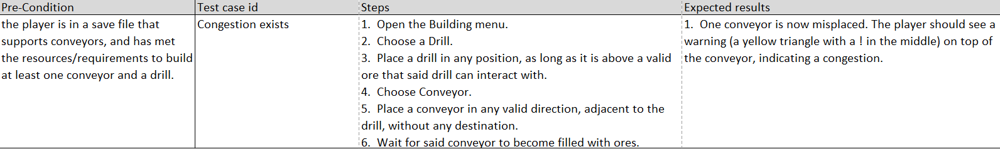

This test is meant to check if a congested conveyor successfully outputs a warning.

#### Pre-Condition: the player is in a save file that supports conveyors, and has met the resources/requirements to build at least one conveyor and a drill.
#### Test Case ID: Congestion exists

#### Steps:

1.  Open the Building menu.
2.  Choose a Drill.
3.  Place a drill in any position, as long as it is above a valid ore that said drill can interact with.
4.  Choose Conveyor.
5.  Place a conveyor in any valid direction, adjacent to the drill, without any destination.
6.  Wait for said conveyor to become filled with ores.

#### Expected Results:

1.  One conveyor is now misplaced. The player should see a warning (a yellow triangle with a ! in the middle) on top of the conveyor, indicating a congestion.


### [TEST #4:](https://youtu.be/nkS-yWTufCk)

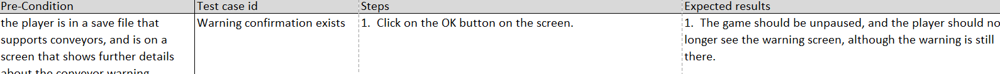

This test is meant to check if an existing warning outputs an error message.

#### Pre-Condition: the player is in a save file that supports conveyors, and has at least one conveyor warning (misplacement or congestion).
#### Test Case ID: Warning output exists

#### Steps:

1.  Click on any conveyor warning sign (a yellow triangle with a ! in the middle).

#### Expected Results:

1.  The game should be paused, and the player should see a text label explaining what caused the warning and some suggestions on how to possibly fix it (both of which depend on the type of warning).


### [TEST #5:](https://youtu.be/fPFkRLS6eP0)

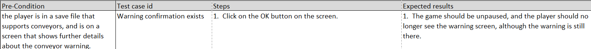

This test is meant to check the player can confirm an error message it just read.

#### Pre-Condition: the player is in a save file that supports conveyors, and is on a screen that shows further details about the conveyor warning.
#### Test Case ID: Warning confirmation exists

#### Steps:

1.  Click on the OK button on the screen.

#### Expected Results:

1.  The game should be unpaused, and the player should no longer see the warning screen, although the warning is still there.


### [TEST #6:](https://youtu.be/2kO2RC1uVhQ)

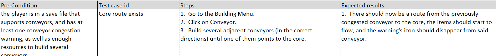

This test is meant to check if a congestion warning is successfully fixed, by routing the congested conveyor to the core.

#### Pre-Condition: the player is in a save file that supports conveyors, and has at least one conveyor congestion warning, as well as enough resources to build several conveyors.

#### Test Case ID: Core route exists

#### Steps:

1.  Go to the Building Menu.
2.  Click on Conveyor.
3.  Build several adjacent conveyors (in the correct directions) until one of them points to the core.

#### Expected Results:

1.  There should now be a route from the previously congested conveyor to the core, the items should start to flow, and the warning's icon should disappear from said conveyor.


### [TEST #7](https://youtu.be/3hiW-2BEp-U)

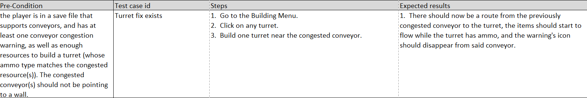

This test is meant to check if a congestion warning is successfully fixed, by adding a turret.

#### Pre-Condition: the player is in a save file that supports conveyors, and has at least one conveyor congestion warning, as well as enough resources to build a turret (whose ammo type matches the congested resource(s)). The congested conveyor(s) should not be pointing to a wall.
#### Test Case ID: Turret fix exists

#### Steps:

1.  Go to the Building Menu.
2.  Click on any turret.
3.  Build one turret near the congested conveyor.

#### Expected Results:

1.  There should now be a route from the previously congested conveyor to the turret, the items should start to flow while the turret has ammo, and the warning's icon should disappear from said conveyor.


### [TEST #8:](https://youtu.be/fOdjCkS4LQE)

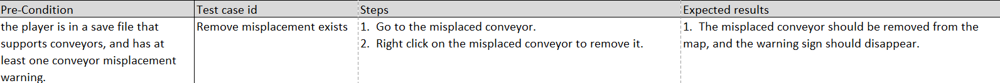

This test is meant to check if a misplacement warning is successfully fixed, by removing one of the misplaced conveyors.

#### Pre-Condition: the player is in a save file that supports conveyors, and has at least one conveyor misplacement warning.
#### Test Case ID: Remove misplacement exists

#### Steps:

1.  Go to the misplaced conveyor.
2.  Right click on the misplaced conveyor to remove it.

#### Expected Results:

1.  The misplaced conveyor should be removed from the map, and the warning sign should disappear.


### [TEST #9:](https://youtu.be/pS9aXQgob-I)

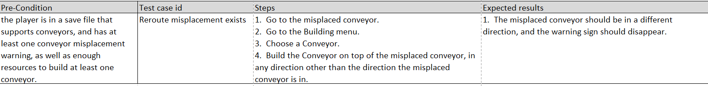

This test is meant to check if a misplacement warning is successfully fixed, by rerouting one of the misplaced conveyors.

#### Pre-Condition: the player is in a save file that supports conveyors, and has at least one conveyor misplacement warning, as well as enough resources to build at least one conveyor.
#### Test Case ID: Reroute misplacement exists

#### Steps:

1.  Go to the misplaced conveyor.
2.  Go to the Building menu.
3.  Choose a Conveyor.
4.  Build the Conveyor on top of the misplaced conveyor, in any direction other than the direction the misplaced conveyor is in.

#### Expected Results:

1.  The misplaced conveyor should be in a different direction, and the warning sign should disappear.


### [TEST #10:](https://youtu.be/a-nF2FqwC2w)

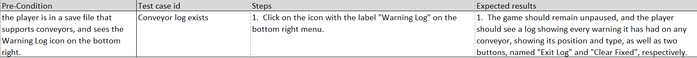

This test is meant to check if the conveyor log opens when the player clicks on its icon.

#### Pre-Condition: the player is in a save file that supports conveyors, and sees the Warning Log icon on the bottom right.
#### Test Case ID: Conveyor log exists

#### Steps:

1.  Click on the icon with the label "Warning Log" on the bottom right menu.

#### Expected Results:

1.  The game should remain unpaused, and the player should see a log showing every warning it has had on any conveyor, showing its position and type, as well as two buttons, named "Exit Log" and "Clear Fixed", respectively.


### [TEST #11:](https://youtu.be/vZnEYUEw3eA)

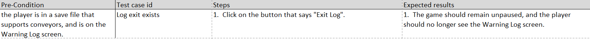

This test is meant to check if the conveyor log exits successfully.

#### Pre-Condition: the player is in a save file that supports conveyors, and is on the Warning Log screen.
#### Test Case ID: Log exit exists

#### Steps:

1.  Click on the button that says "Exit Log".

#### Expected Results:

1.  The game should remain unpaused, and the player should no longer see the Warning Log screen.


### [TEST #12:](https://youtu.be/9PFPIE3k2eI)

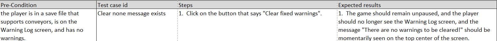

This test is meant to check if the conveyor log successfully shows a message if the player tries to clear all fixed warnings when there are none.


#### Pre-Condition: the player is in a save file that supports conveyors, is on the Warning 
Log screen, and has no warnings.
#### Test Case ID: Clear none message exists

#### Steps:

1.  Click on the button that says "Clear fixed warnings".

#### Expected Results:

1.  The game should remain unpaused, and the player should no longer see the Warning Log screen, and the message "There are no warnings to be cleared!" should be momentarily seen on the top center of the screen.


### [TEST #13:](https://youtu.be/BYZ-08bV8Eo)

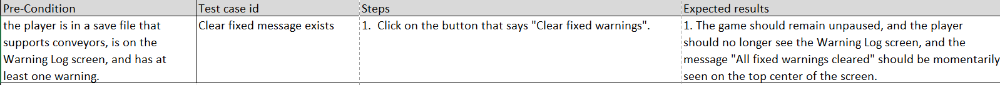

This test is meant to check if the conveyor log successfully clears all the fixed warnings.

#### Pre-Condition: the player is in a save file that supports conveyors, is on the Warning Log screen, and has at least one warning.
#### Test Case ID: Clear fixed message exists

#### Steps:

1.  Click on the button that says "Clear fixed warnings".

#### Expected Results:

1.  The game should remain unpaused, and the player should no longer see the Warning Log screen, and the message "All fixed warnings cleared" should be momentarily seen on the top center of the screen.


### [TEST #14:](https://youtu.be/EqEF6zbh7tQ)

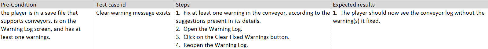

This test is meant to check if the conveyor log successfully shows a message if the player tries to clear all fixed warnings when there is at least one.

#### Pre-Condition: the player is in a save file that supports conveyors, is on the Warning Log screen, and has at least one warnings.
#### Test Case ID: Clear warning message exists

#### Steps:

1.  Fix at least one warning in the conveyor, according to the suggestions present in its details.
2.  Open the Warning Log.
3.  Click on the Clear Fixed Warnings button.
4.  Reopen the Warning Log.

#### Expected Results:

1.  The player should now see the conveyor log without the warning(s) it fixed.

### Review
*(Please add your test specification review here)*
