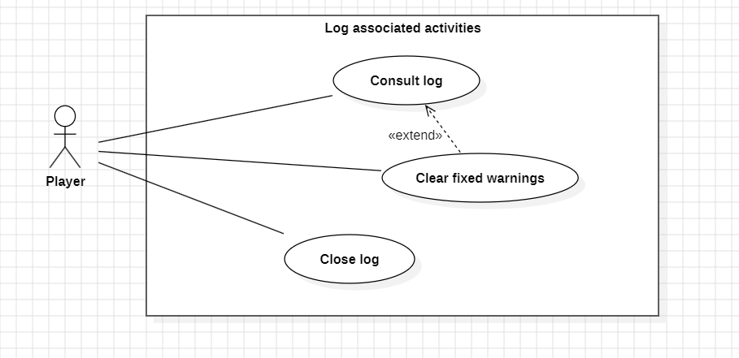
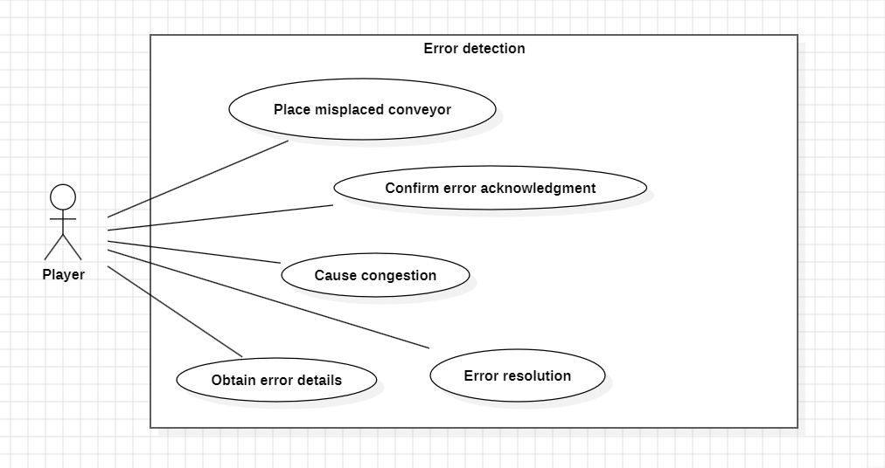
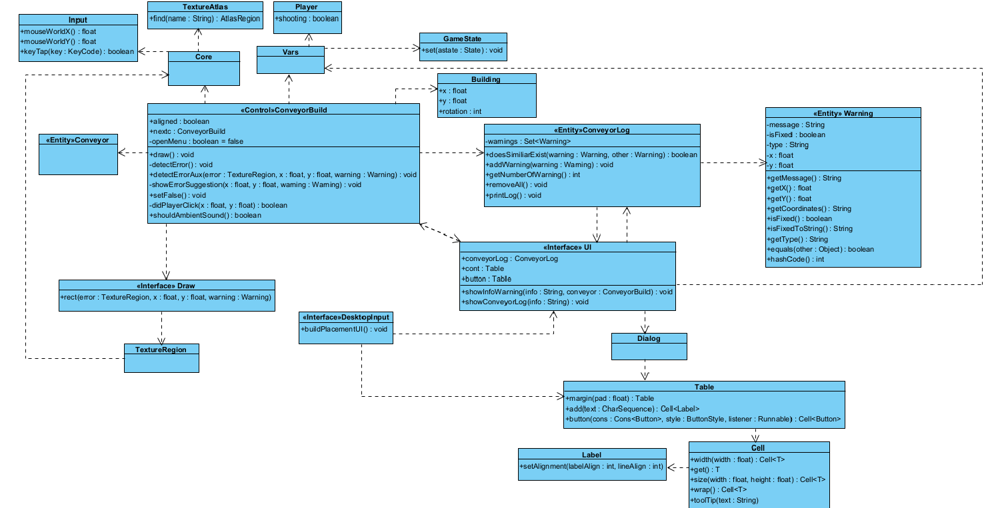

# User story 2
(*Please add a user story short title here*)
## Author(s)
- Raksana Udagedara (67196)
- Guilherme Neto (68663)
## Reviewer(s)
- Clara Dias (67215)
- Ricardo Batista (68509)
## User Story:
**As a** player that likes to keep track of everything, **I want to** receive a text warning everytime I misplace a conveyor for whatever reason and obtain possible fixes, **so that** I can have everything under my watch and build solid structures quickly.
### Review
This addition has great potential, mainly because for new players, conveyor misplacements and poor assemblies may not be obvious at first. It’s important to be careful so that the game’s interface doesn’t become too cluttered with excessive information.
## Use case diagram

## Use case textual description

## Use Case: Place misplaced conveyor.

ID: 1

Description: The player places a conveyor with inconsistent rotation in relation to a previously placed conveyor.
Main actor: player.
Secondary actor: none.
Preconditions:
1. The player is aligning conveyors.
Main scenario:
1. The use case begins when the player places a conveyor with inconsistent rotation relative to a previously placed conveyor.
2. The system alerts the player by displaying a warning icon on the misplaced conveyor.
Postconditions:
1. The system displays the error icon on the misplaced conveyors.
Alternative scenarios: none.

## Use Case: Cause congestion.

ID: 2

Description: The player causes congestion in the circulation of items on the conveyors.
Main actor: player.
Secondary actor: none.
Preconditions:
1. The player places a drill that puts ores into circulation on the conveyors.
Main scenario:
1. The use case begins when the circulation of items on the conveyors stops.
2. The system alerts the player by displaying a congestion warning icon.
Postconditions:
1. The system displays the error icon at the location of the congestion.
Alternative scenarios: none.

## Use Case: Obtain error details.

ID: 3

Description: The player sees an error icon and checks its description.
Main actor: player.
Secondary actor: none.
Preconditions:
1. The player has placed at least one conveyor with an inconsistent rotation relative to a preceding conveyor/there is congestion on the conveyors.
2. The system alerts the player by displaying an icon in the associated location.
Main scenario:
1. The use case begins when the player clicks on the error icon.
2. The system displays a window identifying the error and suggesting a solution.
Postconditions:
1. The player is in the window displaying the reason for the error and the suggested solution.
Alternative scenarios: none.

## Use Case: Confirm error acknowledgment.

ID: 4

Description: The player clicks “OK” to exit the window that identifies the error/suggestion.
Main actor: player.
Secondary actor: none.
Preconditions: 
1. The player has placed at least one conveyor with an inconsistent rotation relative to an immediately preceding conveyor/there is congestion on the conveyors.
2. The system alerts the player by displaying an icon in the associated location.
3. The player is in the window that identifies the error/suggestion.
Main scenario: 
1. The use case begins when the player clicks “OK” to exit the window.
2. The system exits the error/suggestion identification window.
Postconditions:
1. The game resumes.
Alternative scenarios: none.

## Use Case: Error resolution.

ID: 5

Description: The player resolves incorrectly placed conveyors/congestion.
Main actor: player.
Secondary actor: none.
Preconditions:
1. There is at least one error.
Main scenario:
1. The use case begins when the player resolves the error by placing the associated conveyors in the correct position or resolving the congestion.
2. The system stops displaying the error icon.
Postconditions: 
1. The error icon disappears.
Alternative scenarios: none.

## Use Case: Consult log.

ID: 6

Description: The player clicks on the menu icon associated with the log.
Main actor: player.
Secondary actor: none.
Preconditions:
1. Log icon available in the menu.
Main scenario:
1. The use case begins when the player clicks on the log icon.
2. The system displays the warnings present in the log.
Extension Point: Clear fixed warnings.
Postconditions: 
1. The player is in the log window.
Alternative scenarios: none.

## Use Case: Clear fixed warnings.

ID: 7

Description: The player clicks on the button that removes warnings associated with fixed issues.
Main actor: player.
Secondary actor: none.
Preconditions:
1. Log icon available in the menu.
2. There are errors that have already been fixed (error icon is no longer present).
Main scenario:
1. The use case begins when the player selects the option to delete warnings associated with resolved errors from the log.
2. The system updates the log, leaving only warnings associated with unfixed errors.
Postconditions:
1. Log is updated.
Alternative scenarios: No fixed warnings.

## Alternative scenario: No fixed warnings.

ID: 8

Description: The system informs the player that he has not fixed/has no warnings to fix in the log.
Main actor: player.
Secondary actor: none.
Preconditions:
1. Log with no fixed warnings or warnings to fix.
Main scenario:
1. The alternative scenario begins after step 1 of the main scenario.
2. The system informs the player that there are no fixed warnings to remove.
Postconditions: none.
Alternative scenarios: none.

## Use Case: Close log.

ID: 9

Description: The player clicks on the button to close the log.
Main actor: player.
Secondary actor: none.
Preconditions: 
1. The player is on the window that displays the log information.
Main scenario:
1. The use case begins when the player clicks the button to close the log.
2. The system closes the log.
Postconditions:
1. The game resumes.
Alternative scenarios: none.

### Review
*(Please add your use case review here)*
## Implementation documentation
(*Please add the class diagram(s) illustrating your code evolution, along with a technical description of the changes made by your team. The description may include code snippets if adequate.*)
### Implementation summary
(*Summary description of the implementation.*)
#### Review
*(Please add your implementation summary review here)*

### Class diagram

### Review
*(Please add your class diagram review here)*
### Sequence diagrams
(*Sequence diagrams and their discussion in natural language.*)
#### Review
*(Please add your sequence diagram review here)*
## Test specifications
(*Test cases specification and pointers to their implementation, where adequate.*)
### Review
*(Please add your test specification review here)*
