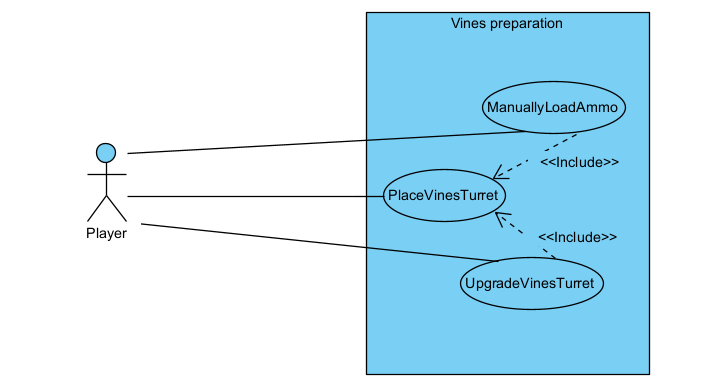
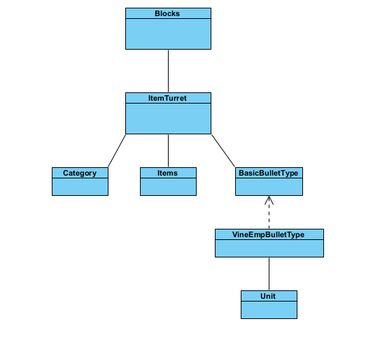
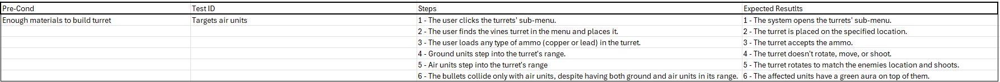
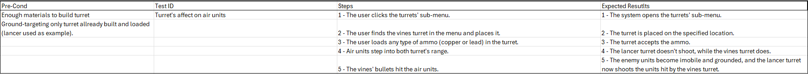
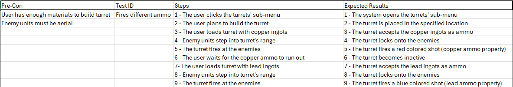

# User story 3
New anti-air defense turret.
## Author(s)
- Afonso Rodriguez (66565)
- Rafael Soares (70116)
## Reviewer(s)
- Raksana Udagedara (67196)
- Guilherme Neto (68663)
## User Story:
**As a** veteran player, **I want to** orchestrate a new defensive strategy by pulling enemy air units to the ground, **so that I can** play the game in a more creative way.
### Review
The user story contributes to the strategic component of the game, proposing a creative feature to balance and improve defense in possible combat situations, aligning with the logic of the game.
This concept is quite outside the box and well thought out, allowing for changes to existing strategies and even the creation of new tactics. It promotes diversity in gameplay and a higher skill ceiling for more advanced players.
However, this user story could be clearer in the concept of veteran player: it is difficult to say whether it is a player who has been playing the game for a long time, or a player who has reached a certain level/milestone in the game.
## Use case diagram

## Use case textual description
(*Please add the use case textual description here.*)
### Review
*(Please add your use case review here)*
## Implementation documentation

The main challenges were figuring out how to create a new turret block that could be placed by the players, and how to make it target only air units and force them into the ground. To overcome this problem we had to create a new type of bullet, and make it so that if any of the bullets fired collides with air units, they become grounded.
### Relevant code snippets
`core/src/mindustry/content.Blocks.java`
```java
vines = new ItemTurret("vines"){{
    requirements(Category.turret, with(Items.copper, 1600, Items.lead, 550, Items.graphite, 600, Items.surgeAlloy, 750, Items.silicon, 400));
    targetGround = false;     
    .
    .
    .
    ammo(Items.copper,  new BasicBulletType(2, 0){{
            instantDisappear = true;
            shootSound = empZap;
            fragBullet = new VineEmpBulletType() {{
                collidesGround = false;
            .   
            .
            .
            }};
    }};
    .
    .
    .
}}
```
`core/src/mindustry/entities/bullet.VineEmpBulletType.java`
```java
if(unit.isFlying()){
    unit.apply(StatusEffects.unmoving, 500f);
    unit.apply(StatusEffects.disarmed, 500f);
    unit.elevation = 0.0f;
}
```
### Implementation summary
Our implementation began by incorporating a custom turret sprite obtained from the official Mindustry spriting community discord. Additionally, a custom firing sound (empZap) was introduced and linked to the turret's shooting behavior. 
A new turret block, vines, was added inside Blocks.java using ItemTurret.java as the base class. Most of its core parameters were configured to our desired goal. The turret supports two ammo types, both mapped to fragmentation bullets. 
These fragments are the ones that generate the actual effect using a custom bullet type we created. The key feature of the bullet is the ability to force airborne units to the ground, disabling their mobility for a specific duration. This combination temporarily suppresses and disarms flying units, making them vulnerable to ground-based defenses.
### Review
*(Please add your implementation summary review here)*
### Class diagrams
(*Class diagrams and their discussion in natural language.*)
### Review
*(Please add your class diagram review here)*
### Sequence diagrams
(*Sequence diagrams and their discussion in natural language.*)
#### Review
*(Please add your sequence diagram review here)*
## Test specifications



### Review
*(Please add your test specification review here)*
