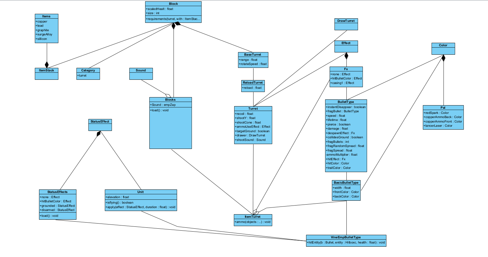
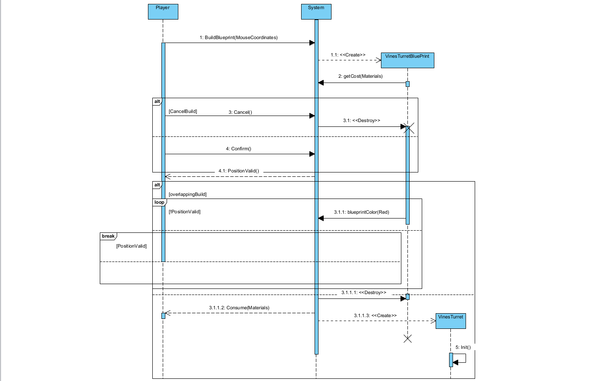
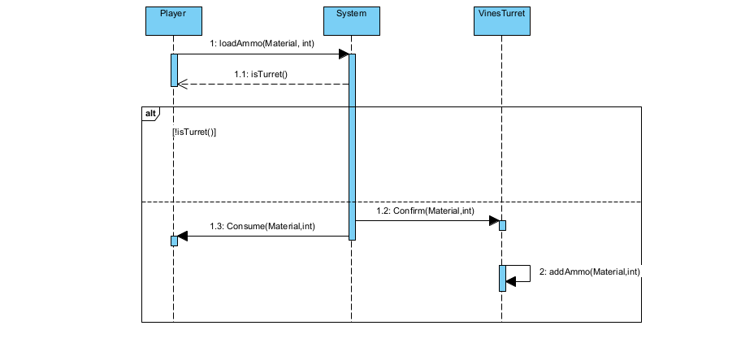
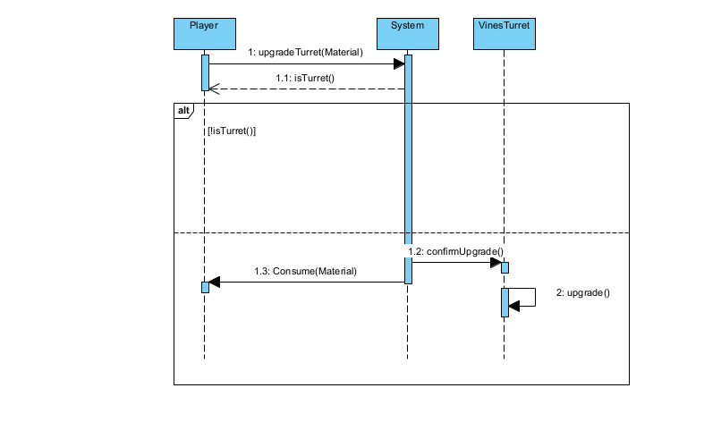

# User story 3
New anti-air defense turret.
## Author(s)
- Afonso Rodriguez (66565)
- Rafael Soares (70116)
## Reviewer(s)
- Raksana Udagedara (67196)
- Guilherme Neto (68663)
## User Story:
**As a** veteran player, **I want to** orchestrate a new defensive strategy by pulling enemy air units to the ground, **so that I can** play the game in a more creative way.
### Review
The user story contributes to the strategic component of the game, proposing a creative feature to balance and improve defense in possible combat situations, aligning with the logic of the game.
This concept is quite outside the box and well thought out, allowing for changes to existing strategies and even the creation of new tactics. It promotes diversity in gameplay and a higher skill ceiling for more advanced players.
However, this user story could be clearer in the concept of veteran player: it is difficult to say whether it is a player who has been playing the game for a long time, or a player who has reached a certain level/milestone in the game.
## Use case diagram

## Use case textual description
## Use Case: PlaceVinesTurret
**ID:** 1

**Description:** Player builds a new vines turret.

**Primary Actor:** Player.

**Secondary Actor:** None.

**Precondition:**
1. The user has enough materials to build a new turret.
2. The user has build mode enabled.

**Main Flow:**
1. This use case starts when the player selects the vines turret in the turrets' sub-menu.
2. The system provides a blueprint that follows the mouse around, indicating where the turret will be placed.
3. The player clicks the left mouse button.
4. The system places a new instance of a vines turret.

**Postconditions:**
1. A new turret is built in place of the blueprint.
2. The required materials to build a vines turret are consumed from the player's core.

**Alternative flows:**
1. CancelPlacemnt
2. OverlappingBuild

### Alternative flow: PlaceVinesTurret:CancelPlacement
**ID:** 1.1

**Description:** Player decides not to build a new turret.

**Primary Actor:** Player.

**Secondary Actor:** None.

**Alternative Flow:**
1. The alternative flow begins after step 2 of the main flow.
2. The player presses the cancel building button.

**PostCondition:**
1. A new VinesTurret has not been built.
2. No resources were consumed.

### Alternative flow: PlaceVinesTurret:OverlappingBuild
**ID:** 1.2

**Description:** Player tries to build a new turret on an invalid tile.

**Primary Actor:** Player.

**Secondary Actor:** None.

**Alternative flow:**
1. The alternative flow begins after step 2 of the main flow.
2. If the turret's blueprint is on top of an already built block or terrain

   2.1 The blueprint turns red, indicating it is an invalid position.
3. If the player clicks to build, while the blueprint is red

   3.1 The system does not built the turret.

   3.2 The system does not consume the building materials.
4. The alternative flow returns to step 2

**PostCondition:**
1. A new VinesTurret has not been built.
2. No resources were consumed.

## Use Case: ManuallyLoadAmmo
**ID:** 2

**Description:** Player loads the placed vines turret with ammo.

**Primary Actor:** Player.

**Secondary Actor:** None.

**Precondition:**
1. There is a vines turret placed without full ammo.
2. The player has at least 1 copper or lead.
3. The game isn't paused.

**Main Flow:**
1. This use case starts when the player starts dragging a specific ammo type into the turret.
2. Include (PlaceVinesTurret).
3. The player drops the materials onto the turret to load it.

**Postconditions:**
1. The selected turret's ammo amount has been increased.
2. The materials used for loading ammo have been removed from the player's inventory.

**Alternative flows:**
1. MisplacedAmmoDrop

### Alternative flow: ManuallyLoadAmmo:MisplacedAmmoDrop
**ID:** 2.1

**Description:** Player dropped the ammo somewhere wrong.

**Primary Actor:** Player.

**Secondary Actor:** None.

**Alternative flow:**
1. The alternative flow begins after step 1 of the main flow.
2. The system doesn't consume any materials, due to wrong placement.
3. The alternative flow returns to step 1 of the main flow.

**Postconditions:**
1. The materials used for loading ammo didn't get removed from the player's inventory.

## Use Case: UpgradeVinesTurret
**ID:** 3

**Description:** Player upgrades a specific vines turret.

**Primary Actor:** Player.

**Secondary Actor:** None.

**Precondition:**
1. There is a vines turret placed that isn't max level.
2. The player has the sufficient materials for the next upgrade.

**Main Flow:**
1. This use case starts when the player presses the upgrade key.
2. Include (PlaceVinesTurret).
3. The turret gets upgraded to the next level.

**Postconditions:**
1. The player gets the materials needed for the upgraded removed from his core.

**Alternative flows:**
1. WrongTile.

### Alternative flow: UpgradeVinesTurret:WrongTile
**ID:** 3.1

**Description:** Tile selected isn't a vines turret.

**Primary Actor:** Player.

**Secondary Actor:** None.

**Alternative flow:**
1. The alternative flow begins after step 1 of the main flow.
2. The player receives the notice that he tried upgrading something unsuccessfully.
3. The alternative flow returns to step 1 of the main flow.

**Postconditions:**
1. The turret doesn't get upgraded.
2. The player doesn't lose any materials.
### Review
*(Please add your use case review here)*
## Implementation documentation
### Relevant classes to the implementation of User Story 3


The main challenges were figuring out how to create a new turret block that could be placed by the players, and how to make it target only air units and force them into the ground.
To overcome this problem we had to create a new type of bullet, and make it so that if any of the bullets fired collides with air units, they become grounded.
### Relevant git commits
Commit `385eb0e` - This was the first commit relative to this user story, focused on the front-end part, this is because to start testing our new turret we had to first be able to deploy it. For that we added our desired turret sprite and added a new block, our logical rationale was to add our turret after the last turret used by the game `meltdown` and it worked, our new turret was being displayed as the last in the turrets sub-menu. We also created a new turret class dedicated to it since we intended to give different upgrades, this class was later removed.

Commit `8b728ad` - This commit was simply adding a new custom sound for our turret.

Commit `a2105de` - After having our turret and a custom sound, it was time to choose a bullet type and give it our desired functionality, we decided to go with laser type bullets for now. Since our original idea had the turret shoot in a radius around it, we implemented its bullet as fragment bullets, this means that shooting only once allows multiple fragmented bullets to appear. We changed a few of the turrets properties for better debugging. After the turret was shooting as intended we implemented its desired feature.

Commit `f42aa8c` - Some simple value tweaks for better debugging.

Commit `69bbcc8` - With everything working as intended, we finally decided to change the bullet type, laser was just not what we wanted and after trying several, we decided to go with a simple bullet, we then created a new bullet type that extends the simple bullet but with our desired features. We also changed the status effect applied to enemy units to our liking.

Commit `5215469` - After the turret working as intended, it was time to actually personalize it to our liking, things like the required materials to build it, etc. This can all be seen in the info page of the turret in-game.

Commit `9d03170` - Since our turret has 2 different ammo types, we decided to change their colour to easily identify them.

Commit `c2cc1c7` - Removed the earlier added class for the new turret, as time was short and previously intended upgrades weren't able to be implemented.

Commit `1fd1133` - Previously bad change, we altered an already implemented status effect for our intentions, affecting other parts of the game without intention, changed it to our own status effect.
### Relevant code snippets
Location: `core/src/mindustry/content.Blocks.java`
```java
vines = new ItemTurret("vines"){{
    requirements(Category.turret, with(Items.copper, 1600, Items.lead, 550, Items.graphite, 600, Items.surgeAlloy, 750, Items.silicon, 400));
    recoil = 2f;
    shootY = 3f;
    reload = 160f;
    range = 160;
    shootCone = 5f;
    ammoUseEffect = Fx.casing1;
    scaledHealth = 250;
    rotateSpeed = 10f;
    coolant = consumeCoolant(0.1f);
    size = 4;
    targetGround = false;
    drawer = new DrawTurret();

    ammo(Items.copper,  new BasicBulletType(2, 0){{
                instantDisappear = true;
                shootSound = empZap;
                fragBullet  = new VineEmpBulletType(){{
                    speed = 2;
                    width = 5f;
                    frontColor = Pal.redSpark;
                    lifetime = 80f;
                    pierce = true;
                    damage = 0f;
                    despawnEffect = Fx.none;
                    collidesGround = false;
                }};
                fragBullets = 360;
                fragRandomSpread = 0f;
                fragSpread = 1f;
                ammoMultiplier = 20;

                hitEffect = despawnEffect = Fx.hitBulletColor;
                hitColor = backColor = trailColor = Pal.copperAmmoBack;
                frontColor = Pal.copperAmmoFront;
            }},
            Items.lead, new BasicBulletType(2f, 10){{
                instantDisappear = true;
                shootSound = empZap;
                fragBullet  = new VineEmpBulletType(){{
                    speed = 2;
                    width = 5f;
                    frontColor = Pal.lancerLaser;
                    lifetime = 160f;
                    pierce = true;
                    damage = 0f;
                    despawnEffect = Fx.none;
                    collidesGround = false;
                }};
                fragBullets = 360;
                fragRandomSpread = 0f;
                fragSpread = 1f;
                ammoMultiplier = 20;

                hitEffect = despawnEffect = Fx.hitBulletColor;
                hitColor = backColor = trailColor = Pal.copperAmmoBack;
                frontColor = Pal.copperAmmoFront;
            }});
}};
```
Location: `core/src/mindustry/entities/bullet.VineEmpBulletType.java`
```java
public class VineEmpBulletType extends BasicBulletType{
    
    @Override
    public void hitEntity(Bullet b, Hitboxc entity, float health){
        //(...)
        
        if(entity instanceof Unit unit){
            if(unit.isFlying()){
                unit.apply(StatusEffects.grounded, 500f);
                unit.apply(StatusEffects.disarmed, 500f);
                unit.elevation = 0.0f;
            }
        }
        handlePierce(b, health, entity.x(), entity.y());
    }
}
```
Location: `core/src/mindustry/content/StatusEffects.java`
```java
grounded = new StatusEffect("grounded"){{
            color = Pal.gray;
            effect = Fx.electrified;
            effectChance = 1f;
            speedMultiplier = 0f;
        }};
```
### Implementation summary
Our implementation began by incorporating a custom turret sprite obtained from the official Mindustry spriting community discord. Additionally, a custom firing sound (empZap) was introduced and linked to the turret's shooting behavior. 
A new turret block, vines, was added inside Blocks.java using ItemTurret.java as the base class. Most of its core parameters were configured to our desired goal. The turret supports two ammo types, both mapped to fragmentation bullets. 
These fragments are the ones that generate the actual effect using a custom bullet type we created. The key feature of the bullet is the ability to force airborne units to the ground, disabling their mobility for a specific duration. This combination temporarily suppresses and disarms flying units, making them vulnerable to ground-based defenses.
### Review
The fact that the introduction to the implementation summary addresses the main challenges highlights the needs identified and associated with implementation.
The section associated with commits explains the changes made and the ideas developed during implementation in a very simple way. It provides a quick and informative overview of what was happening.

**Reviewed by Raksana Udagedara 67196.**
### Class diagrams
The following image is referent to the class diagram, which consists of the classes directly related to our implementation of the user story 3



Although daunting at first sight, most of the classes consist of attributes directly mutated to obtain the desired functionality of our turret. Naturally, most of the shooting and targeting logic have been abstracted from this diagram, since these were already implemented in the base version of the game. Adding these classes and methods *ad nauseam* would just clutter an already enormous diagram.

An important takeaway from this diagram is just how important and interconnected everything is, due to the high amount of compositions present, e.g., removing the **Block** would *brick* the entire system, rendering it useless.  


### Review
*(Please add your class diagram review here)*
### Sequence diagrams

#### Sequence diagram 1: PlaceVinesTurret


This sequence diagram represents the use case where the player places a turret, alongside both its alternative flows, where the user changes their intention to place it and cancels their plan, or, if they try to place a turret in an invalid position (such as over already built blocks)

#### Sequence diagram 2: ManuallyLoadAmmo


The following sequence diagram represents the load ammo use case, where the user manually adds ammunition to a turret by dragging some materials into the turret, as well as the alternative flow, where the user drags the materials somewhere that isn't the turret 

#### Sequence diagram 3: UpgradeVinesTurret


Lastly, this sequence diagram shows the upgrade turret use case, where the user upgrades the turret, and also the alternative flow, where the user tries to upgrade something that isn't the turret
#### Review
The analysis of the sequence diagrams is consistent with their textual description. I consider it to be a concise and highly informative way to understand what actually happens in the system and how things occur.

**Reviewed by Raksana Udagedara 67196.**
## Test specifications

Each test image has an embedded link to a video example
[](https://youtu.be/xJNpCtmNFtg)
[](https://youtu.be/kn7uTUjkd-I)
[](https://youtu.be/Rk-FimCNTfs)
### Review
The tests are in accordance with the scenario-based test template and the videos follow the associated instructions.

**Reviewed by Raksana Udagedara 67196.**